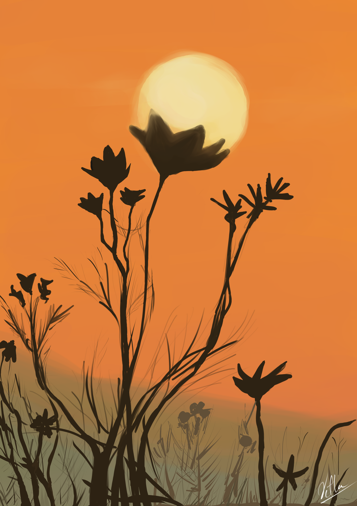
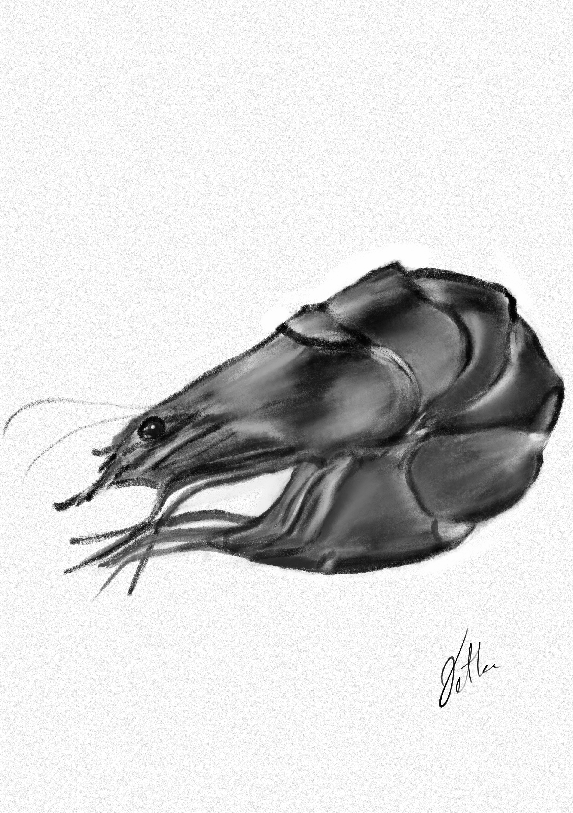

Inktober is a month or year long art challenge created by artist [Jake Parker](https://en.wikipedia.org/wiki/Jake_Parker) in 2008 to improve inking skills and develop positive drawing habits. The month October is selected and participants create
one ink drawing per day, often following a daily prompt list, and share it no social media with a hashtag #inktober, focusing on consistency and creativity rather than perfection.

However, the way I see it is a year long challenge, for me for the year 2026 and I will be following the [2025 Daily Prompts](https://images.squarespace-cdn.com/content/v1/5af1bd791aef1d143f85e67e/41d00f7d-9d39-4722-acc8-d73be454fd32/INKTOBER52+2025.jpg?format=1000w) list. Also, the medium of the art will be digital, not ink on paper.

---

> Sunset - 2026-05-02

> Shrimp - 2026-05-03

## Related

- Selected pieces from earlier digital-art practice: [[gallery]].
