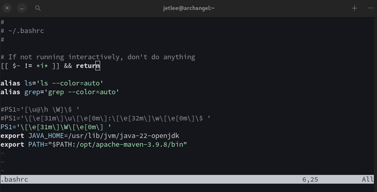

### Windows Command Line 

#### Files & Folders 
<!-- case 1 -->

<details>
<summary>Deleting a non empty directory </summary>  

```bash
rmdir /s /q $DIR_NAME
```
</details>

<!-- case 2 -->

<details>
<summary>Creating a empty file </summary>  

```bash
type NULL > $FILE_NAME
```
</details>

<!-- case 3 -->

<details>
<summary>Removing a File </summary>  

```bash
del $FILE_NAME
```
</details>

#### Variables

<!-- case 1 -->

<details>
<summary> windows-installation\Users\USER-NAME\AppData\local </summary>  

```bash
%localappdata%
```
</details>

---

### Windows Powershell

#### Paths


<!-- case 1 -->

<details>
<summary> Copy the current directory path </summary>  

```bash
(Get-Location).Path | Set-Clipboard
```
</details>

#### Files and Folders

<!-- case 1 -->

<details>
<summary> Copy the file </summary>  

```bash
Copy-Item -Path <source> -Destination <destination>
```
</details>

<!-- case 2 -->

<details>
<summary> Remove the file </summary>  

```bash
Remove-Item -Path "C:\path\to\your\file.txt"
```
</details>

<!-- case 3 -->

<details>
<summary> Rename the file </summary>  

```bash
Rename-Item -Path "C:\path\to\your\file.txt" -Newname "updatedname"
```
</details>

<!-- case 4 -->

<details>
<summary> Move a file </summary>  

```bash
Move-Item -Path "C:\path\to\your\file.txt" -Destination "C:\path\to\your\destinaton"
```
</details>

<!-- case 5 -->

<details>
<summary> Check file hash </summary>  

```bash
Get-FileHash -Path <string> [-Algorithm <string>]
```
</details>

<!-- case 6 -->

<details>
<summary> Remove a non empty directory </summary>  

```bash
Remove-Item C:\path\to\non\empty\folder -Recurse -Force 
```
</details>


<!-- case 7 -->

<details>
<summary> Create a empty file </summary>  

```bash
ni filename.extension
```
</details>

###### Robocopy features

<!-- case 1 -->

<details>
<summary> Mirror a folder to another folder (multi threading) </summary>  

```bash
robocopy "C:\Users\Name\Documents" "D:\Backup\Documents" /MIR /MT:16 /R:3 /W:1 /Z
```
- `/MIR` : copies all files and sub directories and deletes files in the destination if they no longer exists in the source. 
- `/MT:16` : multi-threading, process up to 16 files simultaneously.
- `/R:3` : retry 3 times. Default is 1 million. 
- `/W:1` : wait 1 second b/w retires. 
- `/Z` : restart mode 
</details>

<!-- case 2 -->

<details>
  <summary> Copy files without deleting</summary>

```bash
robocopy "C:\SourceFolder" "E:\DestinationFolder" /E /MT:16 /R:3 /W:1
```

</details>

<!-- case 3 -->

<details>
  <summary> Move files </summary>
  

```bash
robocopy "C:\Downloads" "D:\Archive" /MOVE /E
```

</details>

<!-- case 4 -->

<details>
  <summary> Copy specific files types </summary>
  

```bash
robocopy "C:\MessyFolder" "D:\Images" *.jpg *.png /E
```

</details>


---

### Docker Command Line Interface
 
<!-- case 1 -->

<details>
<summary> Create a new container </summary>  

```bash
docker run -it image-name 
```
- `it` - opens interactive shell
- check if image is present locally, else fetch it from [docker hub](https://hub.docker.com)
</details>

<details>
  <summary>List active containers</summary>  

```bash
docker container ls
```
</details>

<details>
  <summary>List all (non-active/active) containers</summary>  

```bash
docker container ls -a
```
</details>

<details>
  <summary>Run a container</summary>  

```bash
docker start container-name
```
</details>

</details>

<details>
  <summary>Terminate a container</summary>  

```bash
docker stop container-name
```
</details>

<details>
  <summary>Execute a command inside a container</summary>  

```bash
docker exec [-it] container-name command
```
</details>

<details>
  <summary>To list Docker Images</summary>
  
```bash
docker images
```
</details>

<details>
  <summary>To map ports b/w host and image</summary>
  
```bash
docker run -p base-port:image-port image-name
```
</details>

<details>
  <summary>To map environmental variables b/w host and image</summary>
  
```bash
docker run -e key1=value1 -e key2=value2 image-name
```
</details>

<details>
  <summary>Containerize an Image</summary>

- create a `Dockerfile`. Refer this [page](/scribbles/setups/quartz-dev) for example Dockerfile. 
```Dockerfile
	FROM ubuntu
	// run inside image
	RUN command
	// copy code repo
	COPY source destination
	// example copy commands
	COPY package.json package.json
    COPY main.js main.js
    ENTRYPOINT ["entry"]
```

- build the image 

```bash
Docker build -t image-name dockerfile-folder
```

- example

```bash
Docker build -t test-img .
```
- `t` - tag the image so that it can be used along with `start` and `stop` commands
</details>

<details>
  <summary>Check if docker can identify Nvida GPU drivers</summary>
  
```bash
docker run --rm --gpus all nvidia/cuda:12.0.1-base-ubuntu22.04 nvidia-smi
```
</details>

<details>
  <summary>Create from a `docker-compose.yaml` file</summary>
 
 ```bash
 docker compose up -d
 ```
</details>

<details>
  <summary>Install Open-webui and Ollama as single image</summary>
 
 ```bash
 docker run -d -p 3000:8080 --gpus=all -v ollama:/root/.ollama -v open-webui:/app/backend/data --name open-webui --restart always ghcr.io/open-webui/open-webui:ollama
 ```
</details>

---

### Arch Linux Commands

<details>
  <summary>Updating the packages</summary>
 
```bash
pacman -Syu
```
</details>

<details>
  <summary>Installing package(s)</summary>

```bash
pacman -S package1 package2
```
</details>

<details>
  <summary>Installing .pkg.tar.zst packages using Pacman</summary>
 
 ```bash
pacman -U [-noconfirm] <file-name.pkg.tar.zst>
 ```
</details>

<details>
  <summary>Search for an installed package using Pacman</summary>

```bash
pacman -Q | grep <pattern/package_name>
```
</details>

<details>
  <summary>Update the name or move a file or directory</summary>
 
 ```bash
mv source destination
 ```
</details>


<details>
  <summary>Copy a file or directory</summary>

```bash
cp source destination
```
</details>

<details>
  <summary>Extracting a zip files</summary>

```bash
unzip zipfile.zip -d output-directory 
```
</details>


<details>
  <summary>Update font cache</summary>
 
```bash
fc-cache -fv
```
</details>


<details>
  <summary>Remove non empty directory</summary>
 
```bash
rm -r directory-name
```
</details>

<details>
  <summary>Find a file in the system</summary>
 
```bash
[sudo] find <path> -name name-or-extension
```
</details>

<details>
  <summary>Changing the default terminal setting for Gnome console</summary>

```bash
nvim ~/.bashrc
```


```text
\u: Username
\h: Hostname up to the first .
\w: Current working directory
\A: Time in 24-hour format (HH)
\[\e[31m\]: Start of color sequence (red in this case)
\[\e[32m\]: Start of color sequence (green in this case)
\[\e[0m\]: Reset color to default
```
</details>


<details>
  <summary>Creating a desktop launcher for any executable</summary>

- user specific
```bash
nvim ~/.local/share/applications/appname.desktop
```

- system specific
```bash
nvim /user/share/applications/appname.desktop
```

Contents of appname.desktop

```bash
[Desktop Entry]
Version=1.0
Name=Hello World
Comment=Prints Hello, World! to the terminal
Exec=/home/username/hello-world.sh
Icon=utilities-terminal
Terminal=true
Type=Application
Categories=Utility;
```

- make the file executable

```bash
chmode +x path/to/appname.desktop
```
</details>

<details>
  <summary>Installing patch for Suckless terminal</summary>
  
```bash
# Clone the suckless.org repository for the st terminal emulator
git clone https://git.suckless.org/st

# Navigate into the cloned repository directory
cd st

# Create a new directory to store patches
mkdir patches

# Download a specific patch file from a URL (replace with actual URL)
wget url-to-patch-file.diff

# Apply the downloaded patch to the st codebase, assuming it's a standard patch
patch -p1 < patch-file-name

# Move the original patch file into the patches directory (in case we want to revert it later)
mv patch-file.diff patches/

# Remove the config.h file (assuming it was created by the previous patch and no longer needed)
rm config.h

# Clean and install the st terminal emulator using sudo
sudo make clean install
```
</details>

<details>
  <summary>Clean up the system</summary>
 
- remove orphaned packages
```bash
sudo pacman -Rns $(pacman -Qtdq)
```

- clear package cache
```bash
sudo paccache -r  
```

- clean package database
```bash
sudo pacman -Sc
```
- remove unused configuration files
```bash
sudo find /etc -name "*.pacnew" -or -name "*.pacsave" -or -name "*.pacorig" -exec rm -i {} \;
```

- check for broken packages
```bash
lddtree -l -R /usr/lib /usr/bin /usr/sbin 2>/dev/null | grep 'not found'
```

- clean up logs
```bash
sudo journalctl --vacuum-time=2weeks
sudo journalctl --vacuum-size=100M
```

- remove temporary files
```bash
sudo rm -rf /tmp/*
```
</details>

<details>
  <summary>Setting the refresh rate for external monitor</summary>

- Use the `cvt` command to generate a modeline for your desired resolution and refresh rate.  
For example, for a 1920 x 1080 resolution at 100hz  

```bash
cvt 1920 1080 100
# output
1920x1080 99.90 Hz (CVT) hsync: 114.50 kHz; pclk: 285.50 MHz
Modeline "1920x1080_100.00"  285.50  1920 2064 2264 2608  1080 1083 1088 1160 -hsync +vsync
```

- Now add the mode to display
```bash
xrandr --newmode "1920x1080_100.00"  285.50  1920 2064 2264 2608  1080 1083 1088 1160 -hsync +vsync
xrandr --addmode HDMI-1 "1920x1080_100.00" #replace HDMI-1 with correct output name for the display
```

- Set the display to use the new mode
```bash
xrandr --output HDMI-1 --mode "1920x1080_100.00"
```
</details>

