---

title: Neck Locak and Releases
draft: false
date: 2026-04-11
tags: [practice,health,martial-art,study,Compiles]

--- 

### ഒഴിവിന്റെ ഒന്നാം രീതി

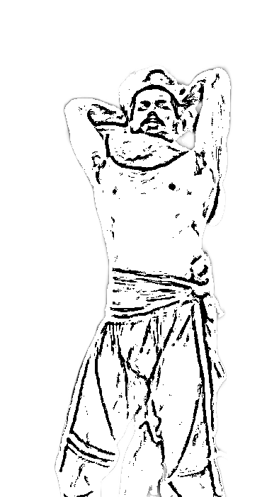

എതിരാളിയുടെ കഴുത്തിന് മുന്ഭാഗത്തും, പിൻഭാഗത്തും പിടിച്ചു എതിരാളിയുടെ പിന് വശത്തേക്ക് മറിക്കുക

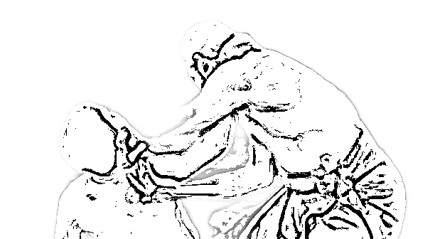

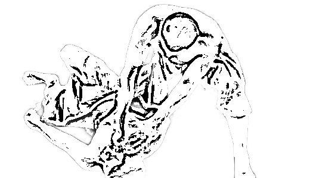

പിടരി, സുമനി മർമ്മങ്ങളിൽ പിടിച്ചാണ് വീഴ്ത്തേണ്ടത്. [സ്ഥാനങ്ങൾ ഇവിടെ നൽകിയിരിക്കുന്നു](/compiles/marma-kalai/padu-marma)

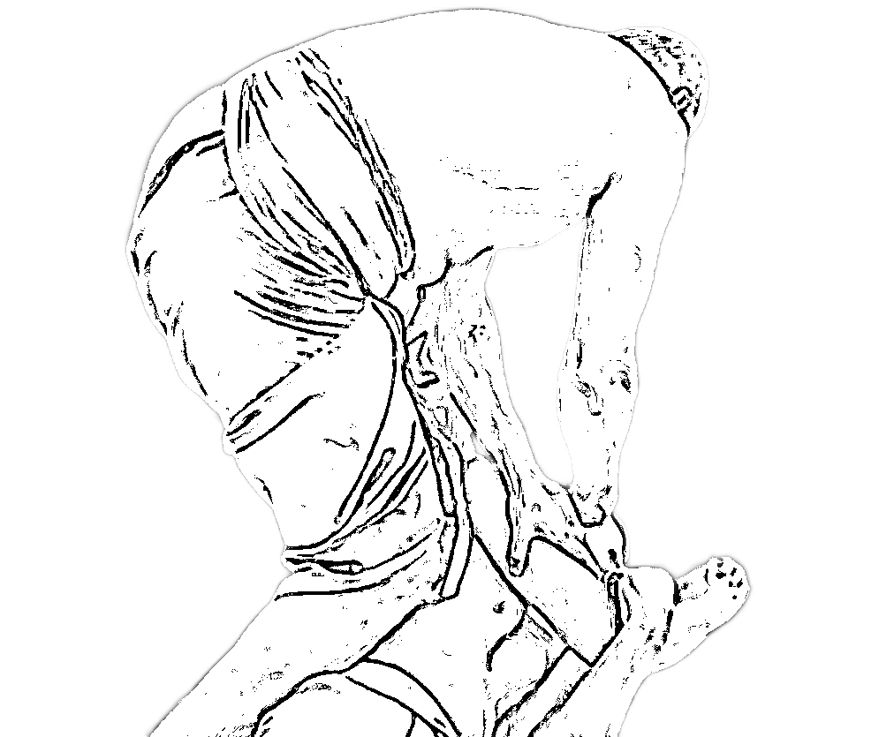

കാല് മുട്ട് വെക്കേണ്ടത് അടപ്പക്കാല മർമ്മത്തിലാണ്

### ഒഴിവിന്റെ രണ്ടാം രീതി

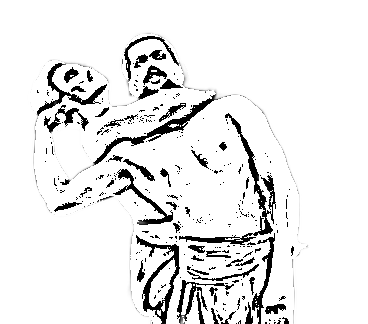

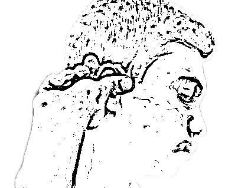

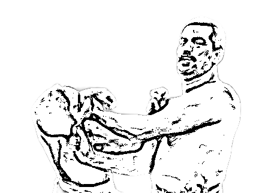

എതിരാളിയുടെ ചെവിയിൽ കൂട്ടുപിടുത്തം പിടിച്ചു മലർത്തി, ശങ്കുതിരികാലത്തിൽ വെട്ടി വീഴ്ത്തണം.

### ഒഴിവിന്റെ മൂന്നാം രീതി

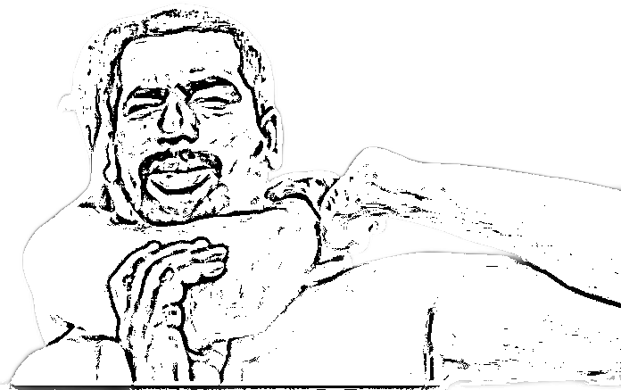

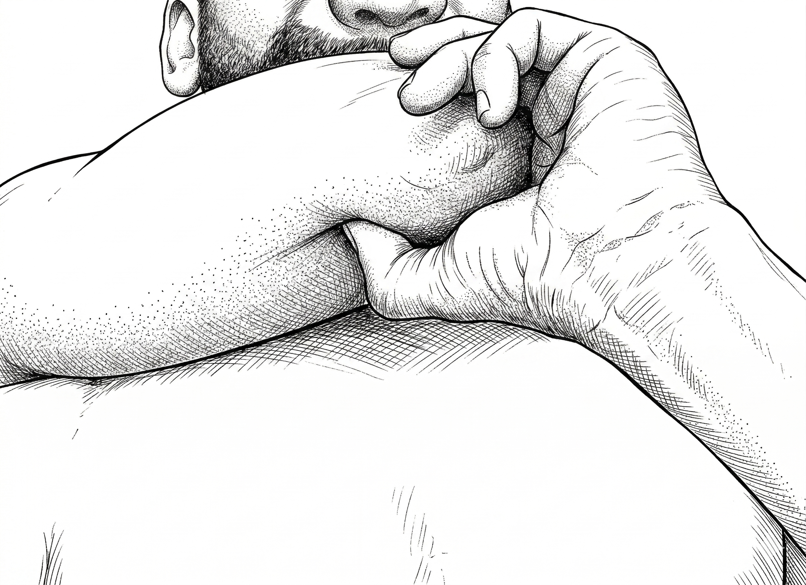

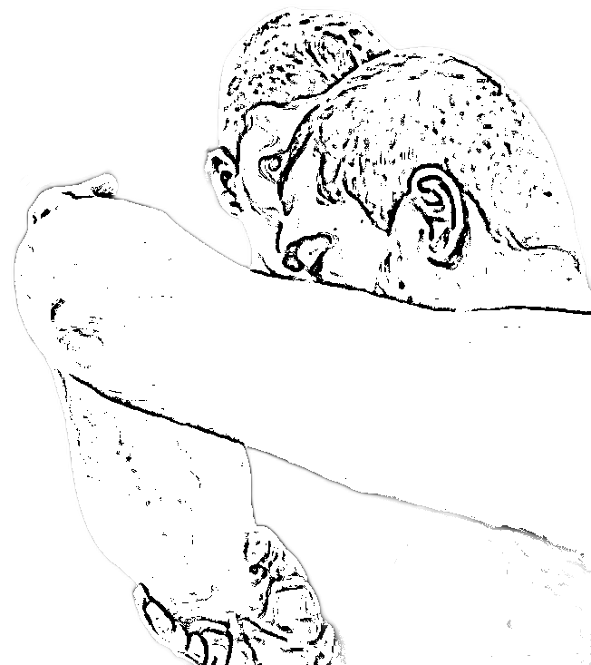

തള്ള വിരൽ '**അമൃതലാന്തി**' മർമ്മത്തിൽ അമർത്തി കൈ അയച്ചു തിരിച്ചു എതിരാളിയെ വീഴ്ത്തുക

### ഒഴിവിന്റെ നാലാം രീതി

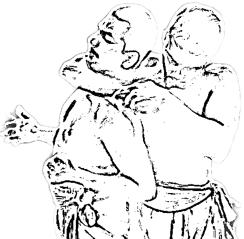

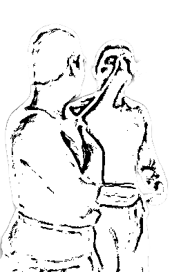

അസ്ഥിചുരിക്കികാല മർമ്മത്തിൽ മുട്ടുകൈകൊണ്ടു അടിച്ചു മുഖത്തിലെ മുനികാശി മർമ്മത്തിൽ മുഷ്ഠി കൊണ്ട് അടിച്ചു നേരിടാം

### ഒഴിവിന്റെ അഞ്ചാം രീതി

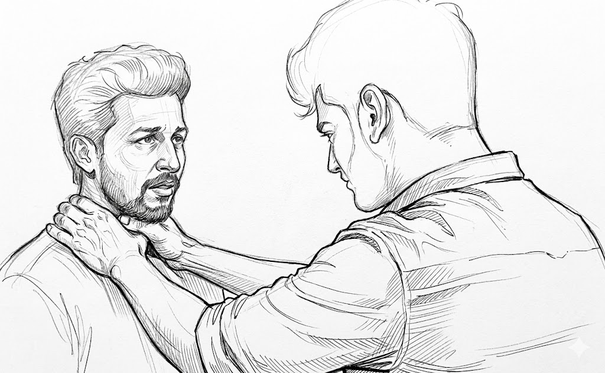

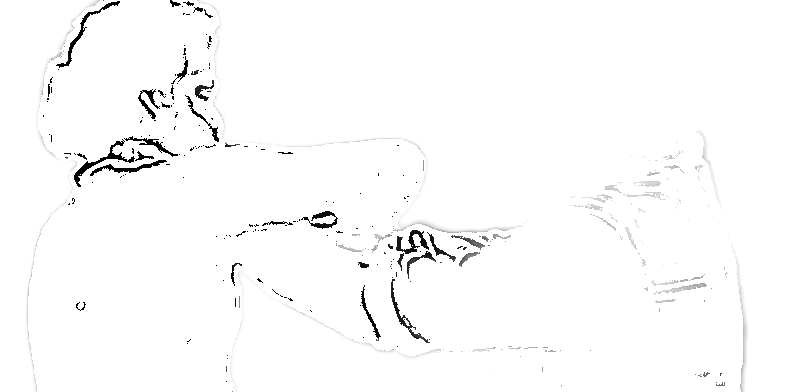

ബലം കുറഞ്ഞ ഭാഗത്തേയ്ക്ക് ചരിഞ്ഞു കൈകൊണ്ടു പുറത്തു നിന്ന് അകത്തേയ്ക്കു കൂടി, മറു കയ്യാൽ മുടി അല്ലെങ്കിൽ തലയിൽ പിടിച്ചു മാറ്റുക. 

### ഒഴിവിന്റെ ആറാം രീതി

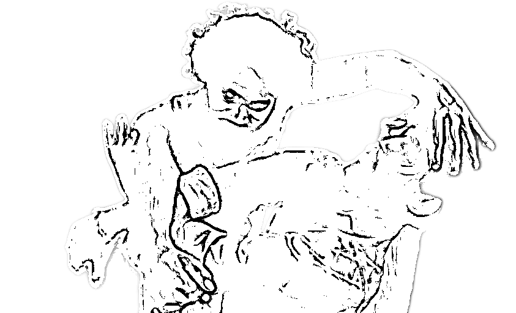

ഇടതു അല്ലെങ്കിൽ വലതു കൈകൊണ്ടു അകത്തു നിന്ന് പുറത്തേയ്ക്കു ഒഴിഞ്ഞു, മറു കൈയ്യാൽ തലകൂട്ടി വശങ്ങളിലേക്ക് മാറ്റുക

തലകൂട്ടി പിടിക്കുന്നതിനു പകരം മുട്ടുകൈകൊണ്ടു കഴുത്തിന് കേറ്റുകയോ, താടിക്കു തട്ടി തലകൂട്ടി പിടിക്കുകയോ ആവാം. 

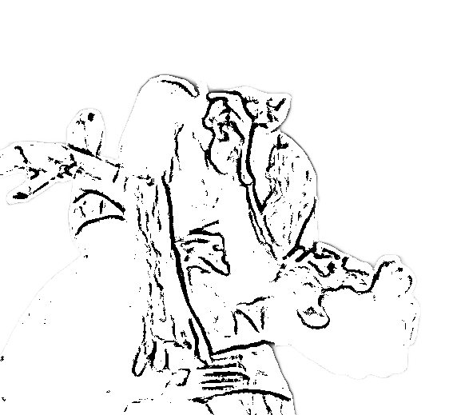

ഒരു കൈക്കു പകരം രണ്ടു കായും കൂടി സുമനിയിൽ കൈമുട്ട് വെച്ച് വീഴ്ത്താം.  [സ്ഥാനങ്ങൾ ഇവിടെ നൽകിയിരിക്കുന്നു](/compiles/marma-kalai/padu-marma)

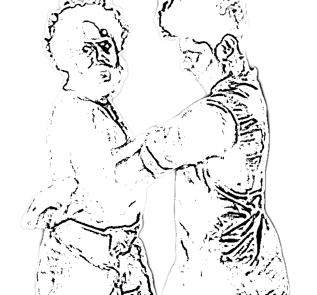

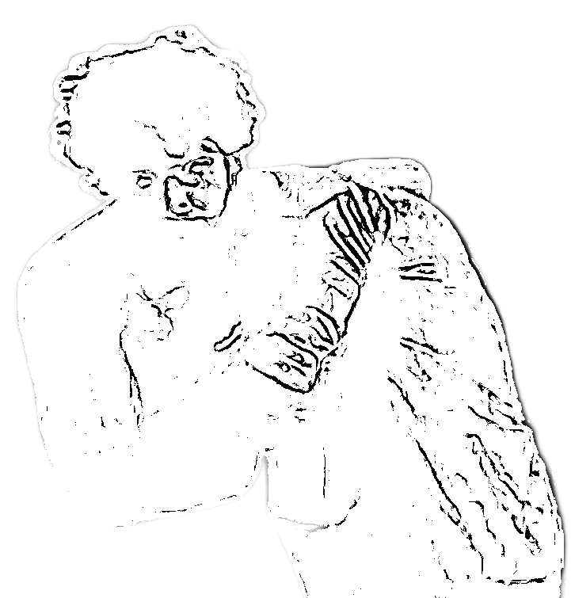

കൈകൊണ്ടു കൂട്ടിപിടിച്ചും, മാറുകൈ കൊണ്ട് വലിഞ്ഞു അമർന്നും പിടിക്കാം.  

### ഒഴിവിന്റെ ഏഴാം രീതി

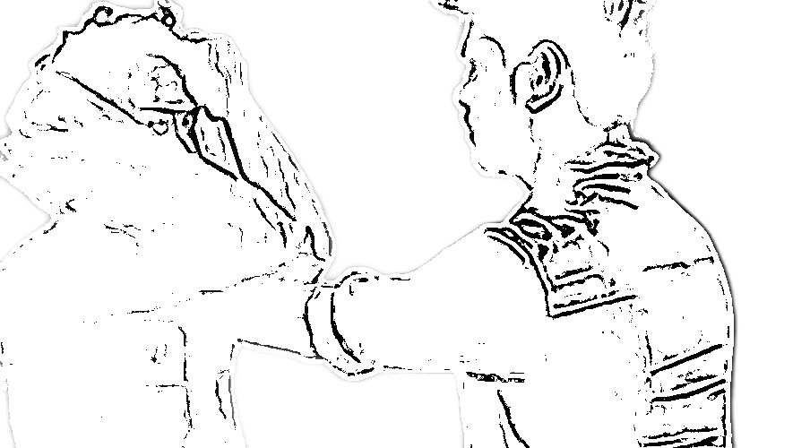

പുറത്തു നിന്ന് അകത്തേയ്ക്കു മുട്ടകൈകൊണ്ടു തട്ടി ഗജവടിവിൽ അമർന്നു ഇരിക്കാം. കൂടാതെ തള്ള വിരലാൽ ഉറക്കകാല മർമ്മത്തിൽ അമർത്താം.

അകത്തു നിന്ന് പുറത്തേയ്ക്കു കൂട്ടിപ്പിടിച്ചു ഇടതു വെച്ച് വലതു ചവിട്ടി വീഴ്ത്താം. 
