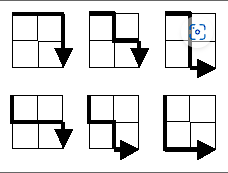

**Project Euler** (named after [Leonhard Euler](https://en.wikipedia.org/wiki/Leonhard_Euler)) is a [website](https://en.wikipedia.org/wiki/Website) dedicated to a series of [computational problems](https://en.wikipedia.org/wiki/Computational_problem) intended to be solved with [computer programs](https://en.wikipedia.org/wiki/Computer_program). The project attracts graduates and students interested in [mathematics](https://en.wikipedia.org/wiki/Mathematics) and [computer programming](https://en.wikipedia.org/wiki/Computer_programming). Since its creation in 2001 by Colin Hughes, Project Euler has gained notability and popularity worldwide. It includes 850+ problems with a new one added approximately every week. Problems are of varying difficulty, but each is solvable in less than a minute of [CPU time](https://en.wikipedia.org/wiki/CPU_time) using an efficient algorithm on a modestly powered computer. --  source - [Wikipedia](https://en.wikipedia.org/wiki/Project_Euler#:~:text=Project%20Euler%20(named%20after%20Leonhard,in%20mathematics%20and%20computer%20programming.)
- **Multiples of 5 or 3** [🔗](https://projecteuler.net/problem=1)
	- Question
	  >If we list all the natural numbers below  10  that are multiples of  3  or  5 , we get  3 , 5 , 6  and  9 .
	  The sum of these multiples is  23 .
	  Find the sum of all the multiples of  3  or  5  below  1000 .
	- Code
	  
	  
	  
	  ```python
	  def solution():
	      """
	      Question
	      If we list all the natural numbers below  10  that are multiples of  3  or  5 , we get  3 , 5 , 6  and  9 .
	      The sum of these multiples is  23 .
	      Find the sum of all the multiples of  3  or  5  below  1000 .
	      :return: the sum of all the multiples of 3 or 5 below 1000
	      """
	      total = 0
	      for i in range(1, 1000):
	          if i % 3 == 0 or i % 5 == 0:
	              total += i
	          else:
	              continue
	      print(f"Sum of all the multiples of 3 or 5 below 1000 = {total}")
	  ```
	- Metrics
	  
	  > Python --version 3.11.8
	  File - [main.py](http://main.py/)
	  Sum of all the multiples of 3 or 5 below 1000 = 233168
	  > 
	  > 
	  > Execution : 0.000000 s
	  > Execution : 0.000 ms
	  > Execution - date : 2024-03-17 01:58:57.586189
- **Even Fibonacci Numbers**  [🔗](https://projecteuler.net/problem=2)
	- Question
	  >Each new term in the Fibonacci sequence is generated by adding the previous two terms.
	  By starting with  1  and  2 , the first  10  terms will be: 1 , 2 , 3 , 5 , 8 , 13 , 21 , 34 , 55 , 89 , …
	  By considering the terms in the Fibonacci sequence whose values do not exceed four million,
	  find the sum of the even-valued terms.
	- Code
	  
	  ```python
	  def solution():
	      """
	      Question
	      Each new term in the Fibonacci sequence is generated by adding the previous two terms.
	      By starting with  1  and  2 , the first  10  terms will be: 1 , 2 , 3 , 5 , 8 , 13 , 21 , 34 , 55 , 89 , …
	      By considering the terms in the Fibonacci sequence whose values do not exceed four million,
	      find the sum of the even-valued terms.
	      :return: sum of even valued fibonacci sequence within 1 and 4 million
	      """
	      term1, term2 = 1, 2
	      even_fib_list = [term2]
	      while True:
	          term3 = term1 + term2
	          if term3 > 4000000:
	              break
	          term1 = term2
	          term2 = term3
	          if term3 % 2 == 0:
	              even_fib_list.append(term3)
	      print(f"Sum of even valued fibonacci sequence till four million = {sum(even_fib_list)}")
	  ```
	- Metrics
	  
	  > Python --version 3.11.8
	  File - [main.py](http://main.py/)
	  Sum of even valued Fibonacci sequence till four million = 4613732
	  > 
	  > 
	  > Execution : 0.000000 s
	  > Execution : 0.000 ms
	  > Execution - date : 2024-03-17 02:03:49.529945
	-
- **Largest Prime Factor of a number**  [🔗](https://projecteuler.net/problem=3)
	- Question
	  >The prime factors of  13195  are  5 , 7 , 13  and  29 .  
	  What is the largest prime factor of the number  600851475143 ?
	- Code
	  
	  ```python
	  import math
	  
	  
	  def is_prime(no):
	      """
	      Function to check if a number is prime or not
	      :param no: the input number, can expect integer
	      :return: boolean. True - input is prime number, False - not a prime number
	      """
	      if no == 2 or no == 3:
	          return True
	      if no < 2 or no % 2 == 0:
	          return False
	      for i in range(int(math.sqrt(no)) + 1, 2):
	          if no % i == 0:
	              return False
	      return True
	  
	  
	  def solution():
	      """
	      Question
	      The prime factors of  13195  are  5 , 7 , 13  and  29 .
	      What is the largest prime factor of the number  600851475143 ?
	      :return: the largest prime factor of the number 600851475143
	      """
	      digit = 600851475143
	      i = 2
	      prime_factors = []
	      while True:
	          # loop termination condition
	          if digit == 1:
	              break
	          if is_prime(i) and digit % i == 0:
	              prime_factors.append(i)
	              digit /= i
	          i = i + 1
	      print(f"Largest prime factor of number 600851475143 = {max(prime_factors)}")
	  
	  ```
	- Metrics
	  
	  > Python --version 3.11.8
	  > File - [main.py](http://main.py/)
	  > Largest prime factor of number 600851475143 = 6857
	  >
	  > Execution : 0.000998 s
	  > Execution : 0.998 ms
	  > Execution - date : 2024-03-19 01:11:05.682793
- **Largest Palindrome Product**  [🔗](https://projecteuler.net/problem=4)
	- Question
	  >A palindromic number reads the same both ways. The largest palindrome made from the product of two 2-digit numbers is
	  9009 = 91 × 99.
	  Find the largest palindrome made from the product of two 3-digit numbers.
	- Code
	  
	  ```python
	  def solution():
	      """
	      Question
	      A palindromic number reads the same both ways. The largest palindrome made from the product of two 2-digit numbers is
	      9009 = 91 × 99.
	      Find the largest palindrome made from the product of two 3-digit numbers.
	      :return: largest palindrome number made from the product of two 3 digit numbers
	      """
	      largest_palindrome = 0
	      for i in range(999, 99, -1):
	          for j in range(i, 99, -1):
	              product = i * j
	              if product <= largest_palindrome:
	                  break
	              product = str(product)
	              if product == product[::-1]:
	                  largest_palindrome = i * j
	  
	      print(f"Largest Palindrome from the product of two three digits = {largest_palindrome}")
	  
	  ```
	- Metrics
	  >Python --version 3.11.8
	  File - main.py
	  Largest Palindrome from the product of two three digits = 906609
	  >
	  Execution : 0.000986 s
	  Execution : 0.986 ms
	  Execution - date : 2024-04-19 13:59:12.935646
- **Smallest Multiple**  [🔗](https://projecteuler.net/problem=5)
	- Question
	  > 2520 is the smallest number that can be divided by each of the numbers from 1 to 10 without any remainder.
	  What is the smallest positive number that is evenly divisible by all of the numbers from 1 to 20?
	- Code
	  
	  ```python
	  import functools
	  
	  
	  def hcf(a, b):
	      """
	      Function to get the highest common factor, i.e. the greatest number which divides each of the two numbers
	      :param a: a non-zero integer
	      :param b: a non-zero integer
	      :return: outputs the HCF
	      """
	      if b != 0:
	          return hcf(b, a % b)
	      else:
	          return a
	  
	  
	  def lcm(x, y):
	      """
	      Function to get the least common multiple, i.e. the smallest common divisible for any two numbers
	      :param x: integer input
	      :param y: integer input
	      :return: outputs the LCM
	      """
	      return x * y / hcf(x, y)
	  
	  
	  def solution():
	      """
	      2520 is the smallest number that can be divided by each of the numbers from 1 to 10 without any remainder.
	      What is the smallest positive number that is evenly divisible by all of the numbers from 1 to 20?
	      :return: smallest positive number that is evenly divisible by all the numbers from 1 to 20
	      """
	      print(f"Result = {functools.reduce(lcm, range(1, 21))}")
	  
	  ```
	- Metrics
	  
	  >Python --version 3.11.8
	  File - main.py
	  Result = 232792560.0
	  >
	  Execution : 0.000000 s
	  Execution : 0.000 ms
	  Execution - date : 2024-04-19 15:28:18.124447
- **Sum Square Difference** [🔗](https://projecteuler.net/problem=6)
	- Question
	  >The sum of the squares of the first ten natural numbers is,
	  1^2 + 2^2+... +10^2 = 385.
	  The square of the sum of the first ten natural numbers is,
	  (1 + 2+... +10)^2 = 55^2 = 3025.
	  Hence the difference between the sum of the squares of the first ten natural numbers and the square of the sum is
	  3025 - 385 = 2640.
	  Find the difference between the sum of the squares of the first one hundred natural numbers and the square of the sum.
	- Code
	  
	  ```python
	  def solution():
	      """
	      The sum of the squares of the first ten natural numbers is,
	      1^2 + 2^2+... +10^2 = 385.
	      The square of the sum of the first ten natural numbers is,
	      (1 + 2+... +10)^2 = 55^2 = 3025.
	      Hence, the difference between the sum of the squares of the first ten natural numbers and the square of the sum is
	      3025 - 385 = 2640.
	      Find the difference between the sum of the squares of the first one hundred natural numbers and the square of the sum.
	      :return: difference b/w sum of square and square of sum of first one hundred natural numbers
	      """
	      sum_of_squares, sum = 0, 0
	      for i in range(1, 101):
	          sum_of_squares += pow(i, 2)
	          sum += i
	      print(f"Difference = {pow(sum, 2) - sum_of_squares}")
	  
	  ```
	- Metrics
	  
	  >Python --version 3.11.8
	  File - main.py
	  Difference = 25164150
	  >
	  Execution : 0.000000 s
	  Execution : 0.000 ms
	  Execution - date : 2024-04-19 15:52:04.116017
- **10001st Prime** [🔗](https://projecteuler.net/problem=7)
	- Question
	  
	  >By listing the first six prime numbers: 2, 3, 5, 7, 11, and 13, we can see that the 6th prime is 13.
	  What is the 10 001st prime number?
	- Code
	  
	  ```python
	  import util.Algorithms
	  
	  
	  def solution():
	      """
	      By listing the first six prime numbers: 2, 3, 5, 7, 11, and 13, we can see that the 6th prime is 13.
	      What is the 10 001st prime number?
	      :return:
	      """
	      digit = 7
	      prime = [2, 3, 5]
	      while len(prime) < 10001:
	          if digit % 10 != 5 and util.Algorithms.is_prime(digit):
	              prime.append(digit)
	          digit = digit + 2
	      print(f'10001st Prime no = {max(prime)}')
	  
	  ```
	- refer [[algorithms/]] for function to find the prime number
	- Metrics
	  
	  >Python --version 3.11.8
	  File - main.py
	  10001st Prime no = 104743
	  >
	  Execution : 0.045000 s
	  Execution : 45.000 ms
	  Execution - date : 2024-04-19 16:03:01.185672
- **Largest Product in a Series** [🔗](https://projecteuler.net/problem=8)
	- Question
	  >The four adjacent digits in the 1000-digit number that have the greatest product are 9 x 9 x 8 × 9 = 5832.
	  73167176531330624919225119674426574742355349194934
	  96983520312774506326239578318016984801869478851843
	  85861560789112949495459501737958331952853208805511
	  12540698747158523863050715693290963295227443043557
	  66896648950445244523161731856403098711121722383113
	  62229893423380308135336276614282806444486645238749
	  30358907296290491560440772390713810515859307960866
	  70172427121883998797908792274921901699720888093776
	  65727333001053367881220235421809751254540594752243
	  52584907711670556013604839586446706324415722155397
	  53697817977846174064955149290862569321978468622482
	  83972241375657056057490261407972968652414535100474
	  82166370484403199890008895243450658541227588666881
	  16427171479924442928230863465674813919123162824586
	  17866458359124566529476545682848912883142607690042
	  24219022671055626321111109370544217506941658960408
	  07198403850962455444362981230987879927244284909188
	  84580156166097919133875499200524063689912560717606
	  05886116467109405077541002256983155200055935729725
	  71636269561882670428252483600823257530420752963450
	  >
	  Find the thirteen adjacent digits in the 1000-digit number that have the greatest product. What is the value of this product?
	- Code
	  
	  ```python
	  def product_calculator(sublist):
	      """
	      Function to calculate product of elements
	      :param sublist: input list
	      :return: returns the product of elements in the list
	      """
	      product = 1
	      for i in sublist:
	          product *= int(i)
	      return product
	  
	  
	  def solution():
	      """
	      Find the thirteen adjacent digits in the 1000-digit number that have the greatest product.
	      What is the value of this product?
	      :return: returns thirteen adjacent digits in the 1000-digit number that have the greatest product
	      """
	      input_data = str(input())
	      base = [int(i) for i in input_data]
	      product = 1
	      index = 12
	      while index < 1000:
	          sublist = base[index - 12:index + 1]
	          if 0 in sublist:
	              index = sublist.index(0) + index + 1
	              continue
	          tentative_product = product_calculator(sublist)
	          if tentative_product > product:
	              product = tentative_product
	          index += 1
	  
	      print(f'Largest product = {product}')
	  
	  ```
	- Input
	  >73167176531330624919225119674426574742355349194934
	  96983520312774506326239578318016984801869478851843
	  85861560789112949495459501737958331952853208805511
	  12540698747158523863050715693290963295227443043557
	  66896648950445244523161731856403098711121722383113
	  62229893423380308135336276614282806444486645238749
	  30358907296290491560440772390713810515859307960866
	  70172427121883998797908792274921901699720888093776
	  65727333001053367881220235421809751254540594752243
	  52584907711670556013604839586446706324415722155397
	  53697817977846174064955149290862569321978468622482
	  83972241375657056057490261407972968652414535100474
	  82166370484403199890008895243450658541227588666881
	  16427171479924442928230863465674813919123162824586
	  17866458359124566529476545682848912883142607690042
	  24219022671055626321111109370544217506941658960408
	  07198403850962455444362981230987879927244284909188
	  84580156166097919133875499200524063689912560717606
	  05886116467109405077541002256983155200055935729725
	  71636269561882670428252483600823257530420752963450
	- Metrics
	  
	  >Python --version 3.11.8
	  File - main.py
	  Largest product = 568995840
	  >
	  Execution : 0.000000 s
	  Execution : 0.000 ms
	  Execution - date : 2024-04-19 16:18:03.960081
- **Special Pythagorean Triplet** [🔗](https://projecteuler.net/problem=9)
	- Question
	  >A Pythagorean triplet is a set of three natural numbers, a < b < c, for which,
	  a^2 + b^2 = c^2.
	  For example, 3^2 + 4^2 = 9 + 16 = 25 = 5^2.
	  There exists exactly one Pythagorean triplet for which a + b + c = 1000.
	  Find the product abc.
	- Code
	  ```python
	  def solution():
	      """
	      Question
	      A Pythagorean triplet is a set of three natural numbers, a < b < c, for which,
	      a^2 + b^2 = c^2.
	      For example, 3^2 + 4^2 = 9 + 16 = 25 = 5^2.
	      There exists exactly one Pythagorean triplet for which a + b + c = 1000.
	      Find the product abc.
	      :return: product of abc
	      """
	      for a in range(1, 2100):
	          for b in range(1, 380):
	              if a < b:
	                  c = 1000 - a - b
	                  if a < b < c and pow(a, 2) + pow(b, 2) == pow(c, 2):
	                      print(f"Product found = {a * b * c}")
	                      break
	  
	  ```
	- Metrics
- **Summation of Primes** [🔗](https://projecteuler.net/problem=10)
	- Question
	  >The sum of the primes below 10 is 2 + 3 + 5 + 7 = 17.
	  Find the sum of all the primes below two million.
	- Code
	  ```python
	  import util.Algorithms
	  
	  
	  def solution():
	      """
	      The sum of the primes below 10 is 2 + 3 + 5 + 7 = 17.
	      Find the sum of all the primes below two million.
	      :return: long int - sum of all the primes < two million
	      """
	      LIMIT = 2000000
	      primes = util.Algorithms.sieve_eratosthenes(LIMIT)
	      filter = [i for i in range(2, LIMIT) if primes[i]]
	      print(f'sum of primes till two million = {sum(filter)}')
	  
	  ```
	- Metrics
	  >Python --version 3.11.8
	  File - main.py
	  sum of primes till two million = 142913828923
	  >
	  Execution : 0.177769 s
	  Execution : 177.769 ms
	  Execution - date : 2024-04-19 23:28:27.822581
- **Largest Product in a Grid** [🔗](https://projecteuler.net/problem=11)
	- Question
	  >In the 20 X 20 grid below, four numbers along a diagonal line have been marked in red.
	  >
	  08 02 22 97 38 15 00 40 00 75 04 05 07 78 52 12 50 77 91 08
	  49 49 99 40 17 81 18 57 60 87 17 40 98 43 69 48 04 56 62 00
	  81 49 31 73 55 79 14 29 93 71 40 67 53 88 30 03 49 13 36 65
	  52 70 95 23 04 60 11 42 69 24 68 56 01 32 56 71 37 02 36 91
	  22 31 16 71 51 67 63 89 41 92 36 54 22 40 40 28 66 33 13 80
	  24 47 32 60 99 03 45 02 44 75 33 53 78 36 84 20 35 17 12 50
	  32 98 81 28 64 23 67 10 26 38 40 67 59 54 70 66 18 38 64 70
	  67 26 20 68 02 62 12 20 95 63 94 39 63 08 40 91 66 49 94 21
	  24 55 58 05 66 73 99 26 97 17 78 78 96 83 14 88 34 89 63 72
	  21 36 23 09 75 00 76 44 20 45 35 14 00 61 33 97 34 31 33 95
	  78 17 53 28 22 75 31 67 15 94 03 80 04 62 16 14 09 53 56 92
	  16 39 05 42 96 35 31 47 55 58 88 24 00 17 54 24 36 29 85 57
	  86 56 00 48 35 71 89 07 05 44 44 37 44 60 21 58 51 54 17 58
	  19 80 81 68 05 94 47 69 28 73 92 13 86 52 17 77 04 89 55 40
	  04 52 08 83 97 35 99 16 07 97 57 32 16 26 26 79 33 27 98 66
	  88 36 68 87 57 62 20 72 03 46 33 67 46 55 12 32 63 93 53 69
	  04 42 16 73 38 25 39 11 24 94 72 18 08 46 29 32 40 62 76 36
	  20 69 36 41 72 30 23 88 34 62 99 69 82 67 59 85 74 04 36 16
	  20 73 35 29 78 31 90 01 74 31 49 71 48 86 81 16 23 57 05 54
	  01 70 54 71 83 51 54 69 16 92 33 48 61 43 52 01 89 19 67 48
	  >
	  The product of these numbers is 26 × 63 × 78 × 14 = 1788696. 
	  What is the greatest product of four adjacent numbers in the same direction (up, down, left, right, or diagonally) in the 
	  grid?
	- Code
	  
	  ```python
	  # Grid constants
	  MIN = 0
	  MAX = 19
	  STEP = 3
	  STRENGTH = 20
	  GRID = []
	  
	  
	  def viability_computation(index):
	      """
	      Function to compute if a given index is viable for computation or not
	      :param index: int - given index
	      :return: bool - True if the given index is viable, else False
	      """
	      return MIN <= index <= MAX
	  
	  
	  def directional_quad_multiplication(i, j, direction):
	      """
	      Function to find the product according to the given directions
	      X - Right axis,
	      -X - Left axis,
	      Y - Top axis,
	      -Y - Bottom axis,
	      X-Y - RightBottom quad,
	      -X-Y - LeftBottom quad,
	      XY - RightTop quad,
	      -XY - LeftTop quad,
	      :parm i : int - the row index
	      :parm j : int - the column index
	      : parm direction : string - the direction in which the elements are computed
	      :return:
	      """
	      x = 0
	      product = 1
	      while x <= STEP:
	          match direction:
	              case 'X':
	                  product *= GRID[i][j + x]
	              case '-Y':
	                  product *= GRID[i + x][j]
	              case 'X-Y':
	                  product *= GRID[i + x][j + x]
	              case '-X-Y':
	                  product *= GRID[i + x][j - x]
	          x += 1
	      return product
	  
	  
	  def solution():
	      """
	      Question
	      What is the greatest product of four adjacent numbers in the same direction (up, down, left, right, or diagonally) in the
	      grid?
	      :return: the greatest product of four adjacent numbers
	      """
	      row = 20
	      product = 1
	      while row > 0:
	          row_list = input().split(' ')
	          row_list = [int(element) for element in row_list]
	          GRID.append(row_list)
	          row -= 1
	  
	      for i in range(STRENGTH):
	          for j in range(STRENGTH):
	              # Right computation
	              global temp
	              if viability_computation(j + STEP):
	                  temp = directional_quad_multiplication(i, j, 'X')
	              # Bottom computation
	              if viability_computation(i + STEP):
	                  temp = directional_quad_multiplication(i, j, '-Y')
	              # Right Bottom computation
	              if viability_computation(i + STEP) and viability_computation(j + STEP):
	                  temp = directional_quad_multiplication(i, j, 'X-Y')
	              # Left Bottom compuation
	              if viability_computation(i + STEP) and viability_computation(j - STEP):
	                  temp = directional_quad_multiplication(i, j, '-X-Y')
	  
	              if product < temp:
	                  product = temp
	  
	      print(f'Highest product found : {product}')
	  
	  ```
	- Input
	  >08 02 22 97 38 15 00 40 00 75 04 05 07 78 52 12 50 77 91 08
	  49 49 99 40 17 81 18 57 60 87 17 40 98 43 69 48 04 56 62 00
	  81 49 31 73 55 79 14 29 93 71 40 67 53 88 30 03 49 13 36 65
	  52 70 95 23 04 60 11 42 69 24 68 56 01 32 56 71 37 02 36 91
	  22 31 16 71 51 67 63 89 41 92 36 54 22 40 40 28 66 33 13 80
	  24 47 32 60 99 03 45 02 44 75 33 53 78 36 84 20 35 17 12 50
	  32 98 81 28 64 23 67 10 26 38 40 67 59 54 70 66 18 38 64 70
	  67 26 20 68 02 62 12 20 95 63 94 39 63 08 40 91 66 49 94 21
	  24 55 58 05 66 73 99 26 97 17 78 78 96 83 14 88 34 89 63 72
	  21 36 23 09 75 00 76 44 20 45 35 14 00 61 33 97 34 31 33 95
	  78 17 53 28 22 75 31 67 15 94 03 80 04 62 16 14 09 53 56 92
	  16 39 05 42 96 35 31 47 55 58 88 24 00 17 54 24 36 29 85 57
	  86 56 00 48 35 71 89 07 05 44 44 37 44 60 21 58 51 54 17 58
	  19 80 81 68 05 94 47 69 28 73 92 13 86 52 17 77 04 89 55 40
	  04 52 08 83 97 35 99 16 07 97 57 32 16 26 26 79 33 27 98 66
	  88 36 68 87 57 62 20 72 03 46 33 67 46 55 12 32 63 93 53 69
	  04 42 16 73 38 25 39 11 24 94 72 18 08 46 29 32 40 62 76 36
	  20 69 36 41 72 30 23 88 34 62 99 69 82 67 59 85 74 04 36 16
	  20 73 35 29 78 31 90 01 74 31 49 71 48 86 81 16 23 57 05 54
	  01 70 54 71 83 51 54 69 16 92 33 48 61 43 52 01 89 19 67 48
	- Metrics
	  >Python --version 3.11.8
	  File - main.py
	  Highest product found : 70600674
	  >
	  Execution : 0.000999 s
	  Execution : 0.999 ms
	  Execution - date : 2024-04-20 00:20:34.221640
- PASS
- PASS
- PASS
- **Lattice Paths** [🔗](https://projecteuler.net/problem=15)
	- Question
	  >Starting in the top left corner of a 2 x 2 grid, and only being able to move to the right and down, there are exactly 6 routes to the bottom right corner.
	  
	  >
	  How many such routes are there through a 20×20 grid?
	- Code
	- Metrics
