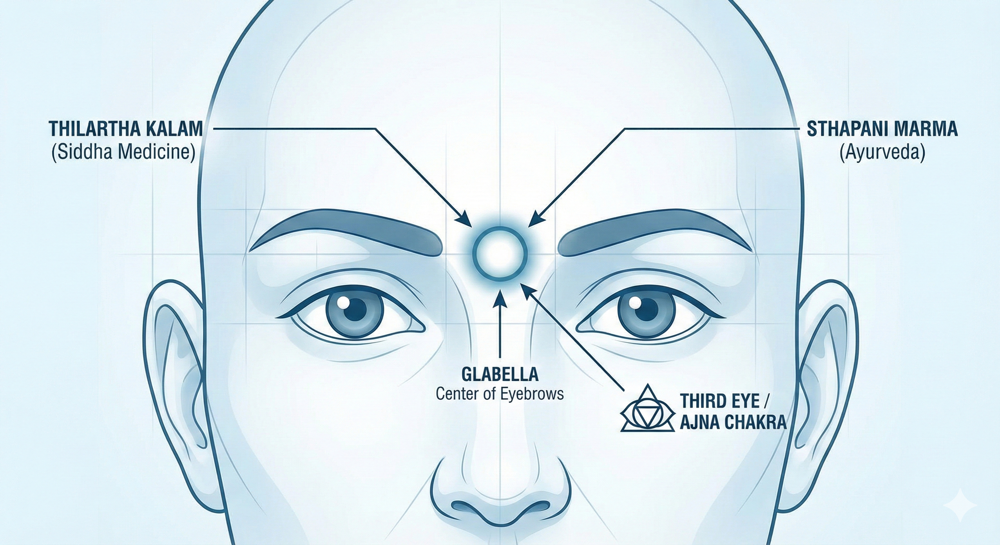
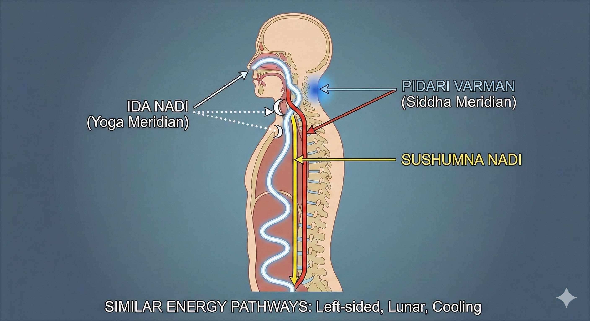
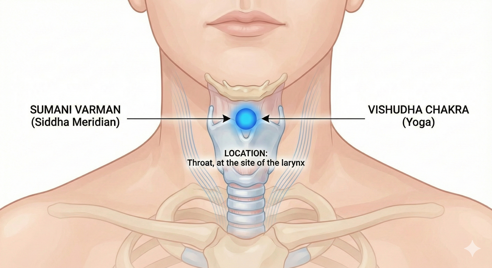

>[!info] All the information are referenced from the book Secrets of Marma: The Lost Secrets of Ayurveda by Dr. Avinash Lele, Dr. Subhash Ranade, and David Frawley.

>[!caution] All the illustrations are generated with the help of AI

## Marma in Siddha System

According to Siddha system, the entire universe is originated from the union of Lord Shiva-matter and his wife Parvati-energy.
Logically Shiva itself represents both matter and energy.
The word Shiva is originated from `Vasi`, which means breathing. All the marmas are invisible but could be traced or located at point where body, mind and psychic energies are concentrated together.
Marma is nothing but blockage of `vitai` energy (Vasi) in the body. This blockage could be due to - external physical injuries,
psychological passions and their effects through `doshas`. This effect can be felt at the psychic energy.

The marmas are divided in two types- Padu Varman and Thodu Varman. The place where the energy is blocked is called as Padu varman. They are 12,
and points where this energy has to struggle to get through are called as Thodu varman. There are 96 such such sites.
Each Padu varman is the junction of 8 Thodu varman sites.

### 12 Padu Marmas

1. **Thilartha kalam** - This meridián is located in the center of the two eyes. This is Sthapani marma in Ayurveda.

2. **Pidari varman**- This meridián is similar to the ida nadi in Yoga.

3. **Sumani varman**- This is at the site of Vishudha chakra in Yoga in the throat.

