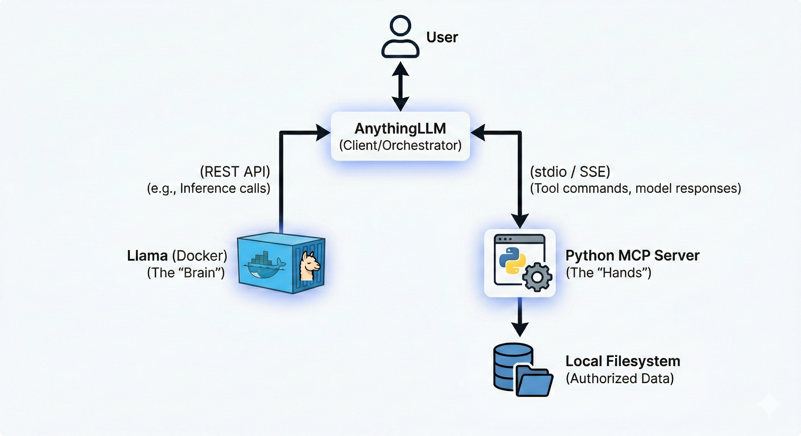

## Introduction

This system is intended to form a closed loop system, which is private and secure. The architecture follows a "client-server-provider" model
where [AnythingLLM](https://anythingllm.com/) acts as the central orchestrator (Client).

>[!note] MCP - Model Context Protocol is an open source standardized universal interface which allows AI models to interact with external tools, data and systems.

### Components

+ **User Interface (AnythingLLM)**: The desktop or Docker-based app where you chat. It manages the conversation history and decides when to call a "tool" (MCP Skill).

+ **Inference Engine (Llama in Docker)**: A containerized instance of Llama (typically via llama.cpp or Ollama). It receives prompts from AnythingLLM and generates text or tool calls.

+ **MCP Server (Python)**: A standalone Python process that implements the Model Context Protocol. It defines specific functions (e.g., list_files, read_content) and translates the AI's requests into actual OS-level file operations.

+ **Local Filesystem**: The secure storage area on your computer that the MCP server is authorized to access.

### Architecture Diagram



## Configuration

>[!IMPORTANT] The system used for configuration is Windows 11 OS. Hence commands needs to be adjusted if you are using another OS.

1. Create dedicated Docker volume

```shell
docker volume create ollama
```

2. Create and run the docker container  

```shell
docker run -d --name ollama -p 11434:11434 -v ollama:/root/.ollama ollama/ollama 
```
For detailed information regarding the docker flags, visit [docker CLI toolkit](/compiles/commands#docker-command-line-interface)

3. Pull the model `llama3.2:3b` inside the container

```shell
docker exec -it ollama ollama pull llama3.2:3b 
```

4. Verify the model existence 

```shell
docker exec -it ollama ollama list
```

5. Perform sanity HTTP test

```shell
Invoke-RestMethod http://localhost:11434/apis/tags
```

6. Configure the MCP server
>[!IMPORTANT] Make sure you have python installed within your system. Follow [Python Installation](/scribbles/python_account)

- Create a python virtual environment called `mcp`. 
- Activate the environment using `mcp\Scripts\activate`
- Install `mcp` dependency using `pip install mcp`
- Create `mcp_server.py` with basic file system tools  

>[!Note] The server can be adapted to work on a specific directory using environment variables   

```python
import asyncio
import os
import shutil
import fnmatch
from pathlib import Path
import mcp.types as types
from mcp.server import Server
from mcp.server.stdio import stdio_server

# --- CONFIGURATION ---
# Change this to your desired workspace folder
WORKSPACE_DIR = Path(r"C:\Users\YourName\Documents\AI_Workspace").resolve()
WORKSPACE_DIR.mkdir(parents=True, exist_ok=True)

server = Server("windows-extended-file-agent")

def validate_path(path_str: str) -> Path:
    """Check if the path is inside the workspace."""
    path = (WORKSPACE_DIR / path_str).resolve()
    if WORKSPACE_DIR not in path.parents and path != WORKSPACE_DIR:
        raise ValueError(f"Access Denied: {path_str} is outside the workspace.")
    return path

# --- TOOL DEFINITIONS ---

@server.list_tools()
async def handle_list_tools() -> list[types.Tool]:
    return [
        types.Tool(
            name="list_files",
            description="Lists all files and folders in the workspace.",
            inputSchema={"type": "object", "properties": {"sub_folder": {"type": "string"}}}
        ),
        types.Tool(
            name="search_files",
            description="Find files using a pattern (e.g., '*.txt' or 'report*').",
            inputSchema={
                "type": "object",
                "properties": {"pattern": {"type": "string"}},
                "required": ["pattern"]
            }
        ),
        types.Tool(
            name="get_file_info",
            description="Get size, creation date, and last modified date of a file.",
            inputSchema={
                "type": "object",
                "properties": {"filename": {"type": "string"}},
                "required": ["filename"]
            }
        ),
        types.Tool(
            name="move_file",
            description="Rename or move a file within the workspace.",
            inputSchema={
                "type": "object",
                "properties": {
                    "source": {"type": "string"},
                    "destination": {"type": "string"}
                },
                "required": ["source", "destination"]
            }
        ),
        types.Tool(
            name="delete_file",
            description="Permanently delete a file from the workspace.",
            inputSchema={
                "type": "object",
                "properties": {"filename": {"type": "string"}},
                "required": ["filename"]
            }
        )
    ]

# --- TOOL LOGIC ---

@server.call_tool()
async def handle_call_tool(name: str, arguments: dict | None) -> list[types.TextContent]:
    args = arguments or {}
    try:
        if name == "list_files":
            target = validate_path(args.get("sub_folder", ""))
            items = os.listdir(target)
            return [types.TextContent(type="text", text="\n".join(items) or "Empty.")]

        elif name == "search_files":
            pattern = args.get("pattern", "*")
            matches = []
            for root, _, filenames in os.walk(WORKSPACE_DIR):
                for filename in fnmatch.filter(filenames, pattern):
                    rel_path = Path(root).relative_to(WORKSPACE_DIR) / filename
                    matches.append(str(rel_path))
            return [types.TextContent(type="text", text="\n".join(matches) or "No matches found.")]

        elif name == "get_file_info":
            target = validate_path(args.get("filename"))
            stats = target.stat()
            info = (f"Size: {stats.st_size} bytes\n"
                    f"Created: {stats.st_ctime}\n"
                    f"Modified: {stats.st_mtime}")
            return [types.TextContent(type="text", text=info)]

        elif name == "move_file":
            src = validate_path(args.get("source"))
            dst = validate_path(args.get("destination"))
            shutil.move(src, dst)
            return [types.TextContent(type="text", text=f"Moved {args['source']} to {args['destination']}")]

        elif name == "delete_file":
            target = validate_path(args.get("filename"))
            if target.is_file():
                target.unlink()
                return [types.TextContent(type="text", text=f"Deleted {args['filename']}")]
            return [types.TextContent(type="text", text="Error: Is a directory, not a file.")]

    except Exception as e:
        return [types.TextContent(type="text", text=f"Error: {str(e)}")]

    raise ValueError(f"Unknown tool: {name}")

async def main():
    async with stdio_server() as (read_stream, write_stream):
        await server.run(read_stream, write_stream, server.create_initialization_options())

if __name__ == "__main__":
    asyncio.run(main())
```

7. Add the MCP server configurations to AnythingLLM 

```json
{
  "mcpServers": {
    "mcp-server-name": {
      "command": "path-with-double-slash-to-python-exe-within-virtual-env",
      "args": [
        "path-with-double-slash-to-mcp_server.py"
      ],
      "env": {
        "Env-VariableName": "path-with-double-slash-to-target-directory"
      }
    }
  }
}
```

8. Interact with the Agent 

+ Create a workspace and configure the workspace to use the local LLM model, using the URL `http://localhost:11434/v1`
+ Use the `@agent` annotation to interact using agent mode
