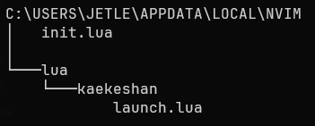

### Folder Configurations

In Windows system the config file (**init.lua**) is located in C:\\Users\\<user>\\AppData\\Local\\nvim directory.   
Create a names space hierarchy in the nvim directory like -  


>kaekeshan is the namespace used in the example.  

==launch.lua== file contains a custom function to control the imports
		  

```lua
LAZY_PLUGIN_SPEC = {} -- global table variable
function spec(item)
    table.insert(LAZY_PLUGIN_SPEC, {import = item}) -- adding imports received as inputs
end

```
		  
use *require("namespace.launch")* in the ==init.lua== file

Under namespace, add ==options.lua== file which will provide basic vim settings and add the dependency like *require("namespace.options")*

```lua
vim.opt.backup = false -- creates a backup file
vim.opt.clipboard = "unnamedplus" -- allows neovim to access the system clipboard
vim.opt.cmdheight = 1 -- more space in the neovim command line for displaying messages
vim.opt.completeopt = {"menuone", "noselect"} -- mostly just for cmp
vim.opt.conceallevel = 0 -- so that `` is visible in markdown files
-- vim.opt.fileencoding = "utf-8" -- the encoding written to a file
vim.opt.hlsearch = true -- highlight all matches on previous search pattern
vim.opt.ignorecase = true -- ignore case in search patterns
vim.opt.mouse = "a" -- allow the mouse to be used in neovim
vim.opt.pumheight = 10 -- pop up menu height
vim.opt.pumblend = 10
vim.opt.showmode = false -- we don't need to see things like -- INSERT -- anymore
vim.opt.showtabline = 1 -- always show tabs
vim.opt.smartcase = true -- smart case
vim.opt.smartindent = true -- make indenting smarter again
vim.opt.splitbelow = true -- force all horizontal splits to go below current window
vim.opt.splitright = true -- force all vertical splits to go to the right of current window
vim.opt.swapfile = false -- creates a swapfile
vim.opt.termguicolors = true -- set term gui colors (most terminals support this)
vim.opt.timeoutlen = 1000 -- time to wait for a mapped sequence to complete (in milliseconds)
vim.opt.undofile = true -- enable persistent undo
vim.opt.updatetime = 100 -- faster completion (4000ms default)
vim.opt.writebackup = false -- if a file is being edited by another program (or was written to file while editing with another program), it is not allowed to be edited
vim.opt.expandtab = true -- convert tabs to spaces
vim.opt.shiftwidth = 2 -- the number of spaces inserted for each indentation
vim.opt.tabstop = 2 -- insert 2 spaces for a tab
vim.opt.cursorline = true -- highlight the current line
vim.opt.number = true -- set numbered lines
vim.opt.laststatus = 3
vim.opt.showcmd = false
vim.opt.ruler = false
vim.opt.relativenumber = true -- set relative numbered lines
vim.opt.numberwidth = 4 -- set number column width to 2 {default 4}
vim.opt.signcolumn = "yes" -- always show the sign column, otherwise it would shift the text each time
vim.opt.wrap = false -- display lines as one long line
vim.opt.scrolloff = 0
vim.opt.sidescrolloff = 8
vim.opt.guifont = "monospace:h17" -- the font used in graphical neovim applications
vim.opt.title = false
-- colorcolumn = "80",
-- colorcolumn = "120",
vim.opt.fillchars = vim.opt.fillchars + "eob: "
vim.opt.fillchars:append {
    stl = " "
}

vim.opt.shortmess:append "c"

vim.cmd "set whichwrap+=<,>,[,],h,l"
vim.cmd [[set iskeyword+=-]]

vim.g.netrw_banner = 0
vim.g.netrw_mouse = 2
		  
```

Under namespace, add ==keymaps.lua== to add basic keymaps and add the dependency like *require("namespace.keymaps")*

```lua
local keymap = vim.keymap.set
local opts = {noremap = true, silent = true}

keymap("n", "<Space>", "", opts)
vim.g.mapleader = " "
vim.g.maplocalleader = " "

keymap("n", "<C-i>", "<C-i>", opts)

-- Better window navigation
keymap("n", "<m-h>", "<C-w>h", opts)
keymap("n", "<m-j>", "<C-w>j", opts)
keymap("n", "<m-k>", "<C-w>k", opts)
keymap("n", "<m-l>", "<C-w>l", opts)
keymap("n", "<m-tab>", "<c-6>", opts)

-- Stay in indent mode
keymap("v", "<", "<gv", opts)
keymap("v", ">", ">gv", opts)

keymap("x", "p", [["_dP]]) -- to retain copied item in the registery

vim.cmd [[:amenu 10.100 mousemenu.Goto\ Definition <cmd>lua vim.lsp.buf.definition()<CR>]]
vim.cmd [[:amenu 10.110 mousemenu.References <cmd>lua vim.lsp.buf.references()<CR>]]
-- vim.cmd [[:amenu 10.120 mousemenu.-sep- *]]

vim.keymap.set("n", "<RightMouse>", "<cmd>:popup mousemenu<CR>")
vim.keymap.set("n", "<Tab>", "<cmd>:popup mousemenu<CR>")

-- more good
keymap({"n", "o", "x"}, "<s-h>", "^", opts)
keymap({"n", "o", "x"}, "<s-l>", "g_", opts)

-- tailwind bearable to work with
keymap({"n", "x"}, "j", "gj", opts)
keymap({"n", "x"}, "k", "gk", opts)
keymap("n", "<leader>w", ":lua vim.wo.wrap = not vim.wo.wrap<CR>", opts)

vim.api.nvim_set_keymap("t", "<C-;>", "<C-\\><C-n>", opts)

```
              
### Package manager
A package manager or package management system (PMS) is a collection of software tools that automates the process of installing, upgrading, configuring, and removing computer programs for a computer in a consistent manner. (reference - [wikipedia](https://en.wikipedia.org/wiki/Package_manager))  

One of the popular package manager for Vim system is [[lazy.nvim]]. There are other managers like **Vim-Plug**, **Pathogen**, **Vindle** etc. 

### Plugins
+ Dev-Icons
    + [devicons-repo](https://github.com/nvim-tree/nvim-web-devicons)
    + configuration
```lua
local devicons = {
    "nvim-tree/nvim-web-devicons",
    event = "VeryLazy"
}

function devicons.config()
    require "nvim-web-devicons"
end

return devicons

```

+ Tree-sitter
    + [treesitter-repo](https://github.com/nvim-treesitter/nvim-treesitter)
    + configuration
```lua
local SPEC = {
    "nvim-treesitter/nvim-treesitter",
    event = {"BufReadPost", "BufNewFile"},
    build = ":TSUpdate"
}

function SPEC.config()
    require "nvim-treesitter.install".compilers = {"zig"} -- install zig using system package manager
    require("nvim-treesitter.configs").setup {
        ensure_installed = {
            "lua",
            "markdown",
            "markdown_inline",
            "bash",
            "python",
            "c",
            "cpp",
            "rust",
            "java",
            "javascript",
            "html",
            "css",
            "csv"
        },
        highlight = {enable = true},
        indent = {enable = true}
    }
end

return SPEC

```

> Use commands like '*TSUpdate*', '*TSInstall*' and '*TSUninstall*' to manage the parsers

+ Hard-time
    + [hardtime-repo](https://github.com/m4xshen/hardtime.nvim)
    + configuration
```lua
local SPEC = {
    "m4xshen/hardtime.nvim",
    dependencies = {"MunifTanjim/nui.nvim", "nvim-lua/plenary.nvim"},
    opts = {}
}

function SPEC.config()
    require("hardtime").setup()
end

return SPEC

```

+ Mason
    + [mason-repo](https://github.com/williamboman/mason-lspconfig.nvim)
    + configuration

```lua
local SPEC = {
    "williamboman/mason-lspconfig.nvim",
    dependencies = {
        "williamboman/mason.nvim"
    }
}

function SPEC.config()
    local servers = {
        "clangd",
        "cssls",
        "jsonls",
        "quick_lint_js",
        "jedi_language_server",
        "rust_analyzer",
        "sqlls",
        "biome",
        "lemminx",
        "html",
        "lua_ls",
        "jdtls",
        "marksman"
    }

    require("mason").setup {
        ui = {
            border = "rounded"
        }
    }

    require("mason-lspconfig").setup {
        ensure_installed = servers
    }
end

return SPEC

```

+ Schema-store
    + [schema-store](https://github.com/b0o/SchemaStore.nvim)
    + configuration
```lua
local SPEC = {
    "b0o/schemastore.nvim",
    lazy = true
}

function SPEC.config()
end

return SPEC

```

+ Lspconfig
    + [lspconfig-repo](https://github.com/neovim/nvim-lspconfig)
    + configuration

```lua
local SPEC = {
    "neovim/nvim-lspconfig",
    event = {"BufReadPre", "BufNewFile"},
    dependencies = {
        {
            "folke/neodev.nvim"
        }
    }
}

local function lsp_keymaps(bufnr)
    local opts = {noremap = true, silent = true}
    local keymap = vim.api.nvim_buf_set_keymap
    keymap(bufnr, "n", "gD", "<cmd>lua vim.lsp.buf.declaration()<CR>", opts)
    keymap(bufnr, "n", "gd", "<cmd>lua vim.lsp.buf.definition()<CR>", opts)
    keymap(bufnr, "n", "K", "<cmd>lua vim.lsp.buf.hover()<CR>", opts)
    keymap(bufnr, "n", "gI", "<cmd>lua vim.lsp.buf.implementation()<CR>", opts)
    keymap(bufnr, "n", "gr", "<cmd>lua vim.lsp.buf.references()<CR>", opts)
    keymap(bufnr, "n", "gl", "<cmd>lua vim.diagnostic.open_float()<CR>", opts)
end

SPEC.on_attach = function(client, bufnr)
    lsp_keymaps(bufnr)

    if client.supports_method "textDocument/inlayHint" then
        vim.lsp.inlay_hint.enable(bufnr, true)
    end
end

function SPEC.common_capabilities()
    local capabilities = vim.lsp.protocol.make_client_capabilities()
    capabilities.textDocument.completion.completionItem.snippetSupport = true
    return capabilities
end

SPEC.toggle_inlay_hints = function()
    local bufnr = vim.api.nvim_get_current_buf()
    vim.lsp.inlay_hint.enable(bufnr, not vim.lsp.inlay_hint.is_enabled(bufnr))
end

function SPEC.config()
    local wk = require "which-key"
    wk.register {
        ["<leader>la"] = {"<cmd>lua vim.lsp.buf.code_action()<cr>", "Code Action"},
        ["<leader>lf"] = {
            "<cmd>lua vim.lsp.buf.format({async = true, filter = function(client) return client.name ~= 'typescript-tools' end})<cr>",
            "Format"
        },
        ["<leader>li"] = {"<cmd>LspInfo<cr>", "Info"},
        ["<leader>lj"] = {"<cmd>lua vim.diagnostic.goto_next()<cr>", "Next Diagnostic"},
        ["<leader>lh"] = {"<cmd>lua require('user.lspconfig').toggle_inlay_hints()<cr>", "Hints"},
        ["<leader>lk"] = {"<cmd>lua vim.diagnostic.goto_prev()<cr>", "Prev Diagnostic"},
        ["<leader>ll"] = {"<cmd>lua vim.lsp.codelens.run()<cr>", "CodeLens Action"},
        ["<leader>lq"] = {"<cmd>lua vim.diagnostic.setloclist()<cr>", "Quickfix"},
        ["<leader>lr"] = {"<cmd>lua vim.lsp.buf.rename()<cr>", "Rename"}
    }

    wk.register {
        ["<leader>la"] = {
            name = "LSP",
            a = {"<cmd>lua vim.lsp.buf.code_action()<cr>", "Code Action", mode = "v"}
        }
    }

    local lspconfig = require "lspconfig"
    local icons = require "kaekeshan.icons" -- extra dependency

    local servers = {
        "clangd",
        "cssls",
        "jsonls",
        "quick_lint_js",
        "jedi_language_server",
        "rust_analyzer",
        "sqlls",
        "biome",
        "lemminx",
        "html",
        "lua_ls",
        "jdtls",
        "marksman"
    }

    local default_diagnostic_config = {
        signs = {
            active = true,
            values = {
                {name = "DiagnosticSignError", text = icons.diagnostics.Error},
                {name = "DiagnosticSignWarn", text = icons.diagnostics.Warning},
                {name = "DiagnosticSignHint", text = icons.diagnostics.Hint},
                {name = "DiagnosticSignInfo", text = icons.diagnostics.Information}
            }
        },
        virtual_text = false,
        update_in_insert = false,
        underline = true,
        severity_sort = true,
        float = {
            focusable = true,
            style = "minimal",
            border = "rounded",
            source = "always",
            header = "",
            prefix = ""
        }
    }

    vim.diagnostic.config(default_diagnostic_config)

    for _, sign in ipairs(vim.tbl_get(vim.diagnostic.config(), "signs", "values") or {}) do
        vim.fn.sign_define(sign.name, {texthl = sign.name, text = sign.text, numhl = sign.name})
    end

    vim.lsp.handlers["textDocument/hover"] = vim.lsp.with(vim.lsp.handlers.hover, {border = "rounded"})
    vim.lsp.handlers["textDocument/signatureHelp"] = vim.lsp.with(vim.lsp.handlers.signature_help, {border = "rounded"})
    require("lspconfig.ui.windows").default_options.border = "rounded"

    for _, server in pairs(servers) do
        local opts = {
            on_attach = SPEC.on_attach,
            capabilities = SPEC.common_capabilities()
        }

        local require_ok, settings = pcall(require, "user.lspsettings." .. server)
        if require_ok then
            opts = vim.tbl_deep_extend("force", settings, opts)
        end

        if server == "lua_ls" then
            require("neodev").setup {}
        end

        lspconfig[server].setup(opts)
    end
end

return SPEC
         
```

The configuration has a dependency on the following 
+ [which-key](https://github.com/folke/which-key.nvim) plugin and icons function

```lua
return {
    kind = {
        Array = " ",
        Boolean = " ",
        Class = " ",
        Color = " ",
        Constant = " ",
        Constructor = " ",
        Enum = " ",
        EnumMember = " ",
        Event = " ",
        Field = " ",
        File = " ",
        Folder = "󰉋 ",
        Function = " ",
        Interface = " ",
        Key = " ",
        Keyword = " ",
        Method = " ",
        -- Module = " ",
        Module = " ",
        Namespace = " ",
        Null = "󰟢 ",
        Number = " ",
        Object = " ",
        Operator = " ",
        Package = " ",
        Property = " ",
        Reference = " ",
        Snippet = " ",
        String = " ",
        Struct = " ",
        Text = " ",
        TypeParameter = " ",
        Unit = " ",
        Value = " ",
        Variable = " "
    },
    git = {
        LineAdded = " ",
        LineModified = " ",
        LineRemoved = " ",
        FileDeleted = " ",
        FileIgnored = "◌",
        FileRenamed = " ",
        FileStaged = "S",
        FileUnmerged = "",
        FileUnstaged = "",
        FileUntracked = "U",
        Diff = " ",
        Repo = " ",
        Octoface = " ",
        Copilot = " ",
        Branch = ""
    },
    ui = {
        ArrowCircleDown = "",
        ArrowCircleLeft = "",
        ArrowCircleRight = "",
        ArrowCircleUp = "",
        BoldArrowDown = "",
        BoldArrowLeft = "",
        BoldArrowRight = "",
        BoldArrowUp = "",
        BoldClose = "",
        BoldDividerLeft = "",
        BoldDividerRight = "",
        BoldLineLeft = "▎",
        BoldLineMiddle = "┃",
        BoldLineDashedMiddle = "┋",
        BookMark = "",
        BoxChecked = " ",
        Bug = " ",
        Stacks = "",
        Scopes = "",
        Watches = "󰂥",
        DebugConsole = " ",
        Calendar = " ",
        Check = "",
        ChevronRight = "",
        ChevronShortDown = "",
        ChevronShortLeft = "",
        ChevronShortRight = "",
        ChevronShortUp = "",
        Circle = " ",
        Close = "󰅖",
        CloudDownload = " ",
        Code = "",
        Comment = "",
        Dashboard = "",
        DividerLeft = "",
        DividerRight = "",
        DoubleChevronRight = "»",
        Ellipsis = "",
        EmptyFolder = " ",
        EmptyFolderOpen = " ",
        File = " ",
        FileSymlink = "",
        Files = " ",
        FindFile = "󰈞",
        FindText = "󰊄",
        Fire = "",
        Folder = "󰉋 ",
        FolderOpen = " ",
        FolderSymlink = " ",
        Forward = " ",
        Gear = " ",
        History = " ",
        Lightbulb = " ",
        LineLeft = "▏",
        LineMiddle = "│",
        List = " ",
        Lock = " ",
        NewFile = " ",
        Note = " ",
        Package = " ",
        Pencil = "󰏫 ",
        Plus = " ",
        Project = " ",
        Search = " ",
        SignIn = " ",
        SignOut = " ",
        Tab = "󰌒 ",
        Table = " ",
        Target = "󰀘 ",
        Telescope = " ",
        Text = " ",
        Tree = "",
        Triangle = "󰐊",
        TriangleShortArrowDown = "",
        TriangleShortArrowLeft = "",
        TriangleShortArrowRight = "",
        TriangleShortArrowUp = ""
    },
    diagnostics = {
        BoldError = "",
        Error = "",
        BoldWarning = "",
        Warning = "",
        BoldInformation = "",
        Information = "",
        BoldQuestion = "",
        Question = "",
        BoldHint = "",
        Hint = "󰌶",
        Debug = "",
        Trace = "✎"
    },
    misc = {
        Robot = "󰚩 ",
        Squirrel = " ",
        Tag = " ",
        Watch = "",
        Smiley = " ",
        Package = " ",
        CircuitBoard = " "
    }
}

```

+ [[language_server_configs/ | Language Server Configurations]]

+ Which-key
    + [whichkey-repo](https://github.com/folke/which-key.nvim)
    + configuration

```lua
local SPEC = {
    "folke/which-key.nvim"
}

function SPEC.config()
    local mappings = {
        q = {"<cmd>confirm q<CR>", "Quit"},
        h = {"<cmd>nohlsearch<CR>", "NOHL"},
        [";"] = {"<cmd>tabnew | terminal<CR>", "Term"},
        v = {"<cmd>vsplit<CR>", "Split"},
        b = {name = "Buffers"},
        d = {name = "Debug"},
        f = {name = "Find"},
        g = {name = "Git"},
        l = {name = "LSP"},
        p = {name = "Plugins"},
        t = {name = "Test"},
        a = {
            name = "Tab",
            n = {"<cmd>$tabnew<cr>", "New Empty Tab"},
            N = {"<cmd>tabnew %<cr>", "New Tab"},
            o = {"<cmd>tabonly<cr>", "Only"},
            h = {"<cmd>-tabmove<cr>", "Move Left"},
            l = {"<cmd>+tabmove<cr>", "Move Right"}
        },
        T = {name = "Treesitter"}
    }

    local which_key = require "which-key"
    which_key.setup {
        plugins = {
            marks = true,
            registers = true,
            spelling = {
                enabled = true,
                suggestions = 20
            },
            presets = {
                operators = false,
                motions = false,
                text_objects = false,
                windows = false,
                nav = false,
                z = false,
                g = false
            }
        },
        window = {
            border = "rounded",
            position = "bottom",
            padding = {2, 2, 2, 2}
        },
        ignore_missing = true,
        show_help = false,
        show_keys = false,
        disable = {
            buftypes = {},
            filetypes = {"TelescopePrompt"}
        }
    }

    local opts = {
        mode = "n", -- NORMAL mode
        prefix = "<leader>"
    }

    which_key.register(mappings, opts)
end

return SPEC
```

+ Cmp
    + [cmp-repo](https://github.com/hrsh7th/nvim-cmp)
    + configuration

```lua
local SPEC = {
    "hrsh7th/nvim-cmp",
    event = "InsertEnter",
    dependencies = {
        {
            "hrsh7th/cmp-nvim-lsp",
            event = "InsertEnter"
        },
        {
            "hrsh7th/cmp-emoji",
            event = "InsertEnter"
        },
        {
            "hrsh7th/cmp-buffer",
            event = "InsertEnter"
        },
        {
            "hrsh7th/cmp-path",
            event = "InsertEnter"
        },
        {
            "hrsh7th/cmp-cmdline",
            event = "InsertEnter"
        },
        {
            "saadparwaiz1/cmp_luasnip",
            event = "InsertEnter"
        },
        {
            "L3MON4D3/LuaSnip",
            event = "InsertEnter",
            dependencies = {
                "rafamadriz/friendly-snippets"
            }
        },
        {
            "hrsh7th/cmp-nvim-lua"
        }
    }
}

function SPEC.config()
    local cmp = require "cmp"
    local luasnip = require "luasnip"
    require("luasnip/loaders/from_vscode").lazy_load()

    vim.api.nvim_set_hl(0, "CmpItemKindCopilot", {fg = "#6CC644"})
    vim.api.nvim_set_hl(0, "CmpItemKindTabnine", {fg = "#CA42F0"})
    vim.api.nvim_set_hl(0, "CmpItemKindEmoji", {fg = "#FDE030"})

    local check_backspace = function()
        local col = vim.fn.col "." - 1
        return col == 0 or vim.fn.getline("."):sub(col, col):match "%s"
    end

    local icons = require "kaekeshan.icons"

    cmp.setup {
        snippet = {
            expand = function(args)
                luasnip.lsp_expand(args.body) -- For `luasnip` users.
            end
        },
        mapping = cmp.mapping.preset.insert {
            ["<C-k>"] = cmp.mapping(cmp.mapping.select_prev_item(), {"i", "c"}),
            ["<C-j>"] = cmp.mapping(cmp.mapping.select_next_item(), {"i", "c"}),
            ["<Down>"] = cmp.mapping(cmp.mapping.select_next_item(), {"i", "c"}),
            ["<Up>"] = cmp.mapping(cmp.mapping.select_prev_item(), {"i", "c"}),
            ["<C-b>"] = cmp.mapping(cmp.mapping.scroll_docs(-1), {"i", "c"}),
            ["<C-f>"] = cmp.mapping(cmp.mapping.scroll_docs(1), {"i", "c"}),
            ["<C-Space>"] = cmp.mapping(cmp.mapping.complete(), {"i", "c"}),
            ["<C-e>"] = cmp.mapping {
                i = cmp.mapping.abort(),
                c = cmp.mapping.close()
            },
            -- Accept currently selected item. If none selected, `select` first item.
            -- Set `select` to `false` to only confirm explicitly selected items.
            ["<CR>"] = cmp.mapping.confirm {select = true},
            ["<Tab>"] = cmp.mapping(
                function(fallback)
                    if cmp.visible() then
                        cmp.select_next_item()
                    elseif luasnip.expandable() then
                        luasnip.expand()
                    elseif luasnip.expand_or_jumpable() then
                        luasnip.expand_or_jump()
                    elseif check_backspace() then
                        -- require("neotab").tabout()
                        fallback()
                    else
                        -- require("neotab").tabout()
                        fallback()
                    end
                end,
                {
                    "i",
                    "s"
                }
            ),
            ["<S-Tab>"] = cmp.mapping(
                function(fallback)
                    if cmp.visible() then
                        cmp.select_prev_item()
                    elseif luasnip.jumpable(-1) then
                        luasnip.jump(-1)
                    else
                        fallback()
                    end
                end,
                {
                    "i",
                    "s"
                }
            )
        },
        formatting = {
            fields = {"kind", "abbr", "menu"},
            format = function(entry, vim_item)
                vim_item.kind = icons.kind[vim_item.kind]
                vim_item.menu =
                    ({
                    nvim_lsp = "",
                    nvim_lua = "",
                    luasnip = "",
                    buffer = "",
                    path = "",
                    emoji = ""
                })[entry.source.name]

                if entry.source.name == "emoji" then
                    vim_item.kind = icons.misc.Smiley
                    vim_item.kind_hl_group = "CmpItemKindEmoji"
                end

                if entry.source.name == "cmp_tabnine" then
                    vim_item.kind = icons.misc.Robot
                    vim_item.kind_hl_group = "CmpItemKindTabnine"
                end

                return vim_item
            end
        },
        sources = {
            {name = "copilot"},
            {name = "nvim_lsp"},
            {name = "luasnip"},
            {name = "cmp_tabnine"},
            {name = "nvim_lua"},
            {name = "buffer"},
            {name = "path"},
            {name = "calc"},
            {name = "emoji"}
        },
        confirm_opts = {
            behavior = cmp.ConfirmBehavior.Replace,
            select = false
        },
        window = {
            completion = {
                border = "rounded",
                scrollbar = false
            },
            documentation = {
                border = "rounded"
            }
        },
        experimental = {
            ghost_text = false
        }
    }
end

return SPEC

		  ```

+ None-ls
    + [none-repo](https://github.com/nvimtools/none-ls.nvim)
    + configurations

```lua
local SPEC = {
    "nvimtools/none-ls.nvim",
    dependencies = {
        "nvim-lua/plenary.nvim"
    }
}

function SPEC.config()
    local null_ls = require "null-ls"

    local formatting = null_ls.builtins.formatting
    local diagnostics = null_ls.builtins.diagnostics

    null_ls.setup {
        debug = false,
        sources = {
            formatting.stylua,
            formatting.prettier,
            formatting.black,
            formatting.clang_format,
            formatting.google_java_format
            -- formatting.prettier.with {
            --   extra_filetypes = { "toml" },
            --   -- extra_args = { "--no-semi", "--single-quote", "--jsx-single-quote" },
            -- },
            -- formatting.eslint,
            -- null_ls.builtins.diagnostics.flake8,
            -- diagnostics.flake8,
            -- null_ls.builtins.completion.spell,
        }
    }
end

return SPEC

```

### References
+ [Ultimate Neovim Config | 2024 | Launch.nvim - YouTube](https://www.youtube.com/watch?v=KGJV0n70Mxs)
