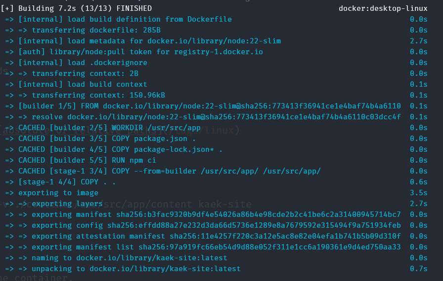
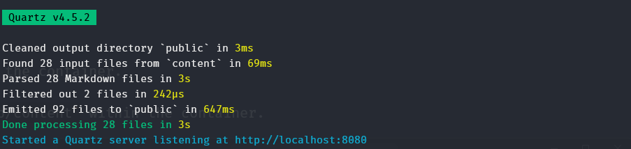

### Local Docker Setup
Install Docker app locally - [Docker file download](https://www.docker.com/products/docker-desktop/) and start the docker engine.

### In built Docker Setup Quartz 
The quartz [repository](https://github.com/jackyzha0/quartz) provides an optimal Docker configuration.  
```Dockerfile
FROM node:22-slim AS builder
WORKDIR /usr/src/app
COPY package.json .
COPY package-lock.json* .
RUN npm ci

FROM node:22-slim
WORKDIR /usr/src/app
COPY --from=builder /usr/src/app/ /usr/src/app/
COPY . .
CMD ["npx", "quartz", "build", "--serve"]
```
### Building and Deploying

Go to the quartz implementation directory and execute the following commands
```text
docker build --tag my-site .
```
>[!info] the dot represents current directory and it can be replaced with [absolute or relative paths](/compiles/linux/linux_administration#module-01---files-and-directories)
This will create the build in the Docker application like below,  
  
```text
docker run --rm -it -p 8080:8080 -p 3001:3001 -e CHOKIDAR_USEPOLLING=true -v ./content:/usr/src/app/content my-site
```
This command instructs the Docker application to,  

1. Start a new container from the `kaek-site` image.
2. Map ports 8080 and 3001 on the host machine to ports 8080 and 3001 in the container.
3. Set the environment variable `CHOKIDAR_USEPOLLING` to true.
4. Mount the `./content` directory from the host machine to `/usr/src/app/content` within the container.
5. Create an interactive shell session within the container. 

This will serve the local quartz development server at __http://localhost:8080/__ 

>[!info] Since the content directory is synced, the updates will be available real time.

#### Set alias for deploy command

I m using Windows system, hence, I use the below Powershell function to set alias for the deploy method to make it easier to develop locally.  
```ps1
# Docker Alias
function kaek-site {
    docker run --rm -it -p 8080:8080 -p 3001:3001 -e CHOKIDAR_USEPOLLING=true -v ./content:/usr/src/app/content my-site
}
```
I will use the build and deploy command both using `&` command like below. 
```text
docker build --tag my-site . && my-site 
```
>[!note] Image needs to be rebuilt for any configuration file changes to take effect. Any file deletion under /content might cause the deployment to terminate. In that case, you can redeploy using the alias. 
