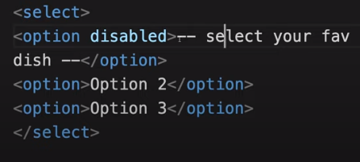

HTML helps to add structure to the webpage.  
current version of html = [html5](https://html.com/html5/)
The first file to parse will be ==index.html==.  
Common terms to note down are element (set of start, end tags and content in b/w).  
For example: ```<p> This is a an example of element</p>```  
The start tag is : ```<TAG_NAME>```  
The end tag is : ```</TAG_NAME>```
Concept of parent-child relation is important in HTML

#### Basic Structure of an HTML document

```html

<!DOCTYPE html> <!-- requried preamble -->
<html lang="en">
  <head> <!-- to delcare metadata, styles, script etc.. -->
    <meta charset="UTF-8">
    <meta name="viewport" content="width=device-width, initial-scale=1.0">
    <meta http-equiv="X-UA-Compatible" content="ie=edge">
    <title>My Website</title>
    <link rel="stylesheet" href="./style.css">
    <link rel="icon" href="./favicon.ico" type="image/x-icon">
  </head>
  <body> <!-- page content goes here -->
    <main>
        <h1>Welcome to My Website</h1>  
    </main>
    <script src="index.js"></script>
  </body>
</html>

```

### Definitions

HTML syntax information can be found [here](https://html.spec.whatwg.org/#syntax)

> [!tip] HTML indendation or linebreaks are not considered by Browser engines while rendering the webpage

#### Text Elements
- Comments : start with ```<!--``` and end with ```-->``` 
- Headings : ```<h1>``` to ```<h6>```, H1 > H2 .. > H6 
- Paragaraph : ```<p>```, in-line element
- Bold text : ```<b>``` : no semantic meaning, usage is discouraged
            : ```<strong>``` : *recommended*
- Italics text : ```<i>``` : no sematic meaning, usage is dicouraged  
               : ```<em>``` : *recommended*
- List
    - Orderd list, start with ```<ol>``` and individual list items are enclosed within ```<li> ... </li>``` 
    - Unorderd list, start with ```<ul>``` and individual list items are enclosed within ```<li> ... </li>```

#### Image Elements
- Image : element with no content, hence self closing. Element is ``````
        : closing slash is not mandatory
    - Common attributes of **img** are:  
        - ==src== to define the source of image
        - ==alt== to define the alternative text
        - ==height== to define the height of image
        - ==width== to define the width of image

> [!info] src, alt and similar properties of an element is called Attributes. They are used to describe the element

#### Hyperlinks
- Links : elements that can point to an external or internal resource. Element starts with ```<a>```
    - Common attributes of **a**(anchor) element
        - ==href== to define the url of the target; URL to external resources or internal page path;  
          example: ```href="https://developer.mozilla.org/en-US/docs/Web/HTML"``` or ```href="blog.html"```
                 : To have link that does not direct anywhere, use ```href="#"```
        - ==target== to define the behavior of the anchor; ```target="_blank"``` will open the link in a new tab

#### Page Structuring
- Navigation : element starts with ```<nav>```   
- Header : defines the part where, logo, title and navigation bar are grouped together. Element starts with ```header```
- Article : container element for article. Element starts with ```<article>```
- Footer : continer element for footer text/contents. Element starts with ```<footer>```
- Div : container element used when we does not want to attach a certain meaning to a part of page. Element starts with ```<div>``` 
- Aside : defines secondary information that compliments the primary content of page. Element starts with ```<aside>```

>[!note] Html Entitties
> Reserve characters in HTML must be replaced with entitites  
> Examples would be copyright, less than, greater than, non breaking space etc.  
> Common list of HTML entities can be referenced from here - [Mozilla Developer - Character Reference](https://developer.mozilla.org/en-US/docs/Glossary/Character_reference)

#### Semantic HTML

Semantic HTML refers to the use of HTML tags that convey the meaning and structure of web content, rather than just its appearance.  
Semantic elements clearly describe their purpose both to the browser and to developers, making web pages more accessible, easier to maintain, and better for SEO.

- Why use Semantic HTML ?
    - ==Accessibility==: Screen readers and assistive technologies can better interpret the content.
    - ==SEO==: Search engines can better understand and rank your content.
    - ==Maintainability==: Code is easier to read and maintain for developers.

##### Non-Semantic

```html
<div id="header">My Website</div>
<div id="nav">Home | About | Contact</div>
<div id="content">Welcome to my website!</div>
```

##### Semantic

```html
<header>My Website</header>
<nav>Home | About | Contact</nav>
<main>Welcome to my website!</main>
```


### Common basic tags
- heading tags
    - start from `<h1>` - `<h6>`
        
- paragraph tag
    - tag is `<p>` and `</p>` , // for differentiating text into different paragraphs.
        
- anchor tag
    - tag is `<a>` and `</a>`, attributes(additional information associated to tag) include :
        -  target = "_blank" // open the link in new tab 
        - href = "" // for def hyperlink
        - `<a href="url/path" target="_blank">string</a>`
        
- button tag
    - creates a clickable button. use tag `<button>_button_name_string_</button>`
    - easy way to associate a button to a hyperlink is using the button tag as nesting inside the anchor tag

 ```html
<a href="www.google.com" target="_blank"><button>google.com</button></a>
```
        
- bold tag 
    - `<b>string</b>` // to make bold
- italic tag
    - `<i> italic text </i>`
- image tag  
    // to add/embedd image into the html file  
    // adding a closing tag makes the code redundant., hence opening tag and attributes inside it is enough to specify the appropriate information.  

use ` .. </img>`

```html

```
        
- video tag // to embed a video
    - tag for video is `<video> .. </video>`
        
```html
<video control width="" height="">
<source src="link to video">
</video>
```
        
- audio tag // to embed audio and it is similar to video
        
```html
<audio controls>
<source src="link to audio file">
</audio>
```
        
- input tag

enables interaction with user, 
input tag uses `<input>`, no closing tags, attributes will provide required information  
    - type="" // button, checkbox, text, etc..  
    - type specifies the type of input the site should expect.
        
- select tag

we have `<select> .. </select>` and inside we have `<option> .. </option>`
        
```html
<input type="text" placeholder="choose an item">
<select>
<option> item 1 </option>
<option> item 2 </option>
<option> item 3 </option>
</select>
```
        
- we have 'disabled' attribute for option tag


        
- table tag // to format, or embed tabular data into the webpage
        
```html
<table>
        <thead>
         // automatically bolded text as head for table
          <tr> // one row
        	 <th> one column </td>
           <th> two column </td>
           <th> three column </td>
          </tr>
        
        <thead>
        <tbody> // body of table
          <tr> // one row
        	 <td> one column </td>
           <td> two column </td>
           <td> three column </td>
          </tr>
          <tr> // two row
        	 <td> one column </td>
           <td> two column </td>
           <td> three column </td>
          </tr>
        </tbody>
</table>
```
Table have attributes like border, color etc.

### Basics of CSS

 - Adds a touch of life to the structure coded by html and it makes the webpage more presentable.

- types of CSS applied in a file
    1. external // an external file
    2. internal // on the head section of html file
    3. inline // direct on the element  
- Concepts
    - linking to the html file, if external style sheet is used  
    `<link href="absolute_path_of_css_file">`
    - link tag can also be used for : 
        - linking style sheet
        - for prefetching resources
        - can be used for metadata  
    - hence we need to specify more information  
    `<link href="path to file" rel="stylesheet">` // the relationship of this file is stylesheet
        
- Structure  

The styles applied to a targeted tag, all the nested tags inside that targeted tag, we call it children, will inherit the style properties, unless children have their own styling.        
CSS specificity : it allows the browser to take the correct styles for a tag if there is a conflict.
        
`TAG_NAME {
    property_name : property_value;
}`        

- values are not written inside quotes in normal case.
- CSS takes priority on top down fashion, i.e. if more priority is assigned as we go down.  

example: here black will have more priority than red, hence black color will be applied to the tag, p under consideration.  

        
- Classes
        
Used to group elements. Since we have finite no of tags, and styling by tag name will exhaust out options for different styles, we use class to group elements which we assign common properties.  

classes are specified inside the tag opening in html file as **class = "",  
i.e. < tagname class="classname" >**  

class names are specified using, dot operator. i.e. `.class_name { property_name : property_value; }`
        
- IDs

similar concept as classes, expect difference in symbol. in c.s.s., we specify the id by a # as prefix. Every id should be unique, it is bad practice to use the same id name multiple times.  

`#id_name { property_name : property_value; }`

- position
    - static
        - default placement, goes with default html element flow
    - relative
        - gets access to four different directions
        - value 0 is the original position
        
        ```html
        top :  // from top
        bottom : // from bottom
        left : // from left
        right : // from right
        ```
        
    - absolute
        - element can not go out of the parent element
        - we can move it inside the parent element
        
    - fixed
        - it places the element relative to the screen or view port
    - sticky
        - adding top 0 will keep the element stick to the top of the webpage as we scroll
- auto and 100%
    - auto : adjusting to the view port
        - use whatever space available
    - 100% : 100% of the parent, will give scrolling
- CSS units on view port
    - vh  : view port height // sets the height relative to the view port
    - vw : view port width
    - vmax : view port maximum
    - vmin: view port minimum
- layout
    - display: flex
        - called a flex box
        - justify-content // is accessible
        - align-items // is accessible

---

- setting up header, html
    
```html
<div class="container">
    <div class="header">
        <div class="logo">
            <a class="logo-text" href="#">TITLE</a>
        </div>
        <div class="login">
            <!-- setting tabs -->
            <form clas="login">
                <table class="logo-controls">
                    <tr>
                        <td>Username</td>
                        <td>password</td>
                    </tr>
                    <tr>
                        <td><input type="text" /></td>
                        <td><input type="password" /></td>
                        <td><input type="submit" value="login" /></td>
                    </tr>
                    <tr>
                        <td></td>
                        <td>Forgot password</td>
                    </tr>
                </table>
            </form>
        </div>
    </div>
</div>

```
    
- css
        
```html
        * {
        	margin : 0;
        	padding : 0;
        	box-style : border-box;
         }
        
        .header {
        	background : #3b5998;
        	width : 100%;
        	height : 85px;
        }
        
        .logo {
        	width : 50%;
        }
        
        .login {
        	width : 50%;
          float : left; // since div are arranged automatically dn to previous elts
        }
        
        .logo-text {
         color: #fff;
         font-size : 35px;
         font-weight : bold;
         text-decoration : none;
        
        }
        
```
        
