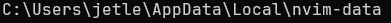
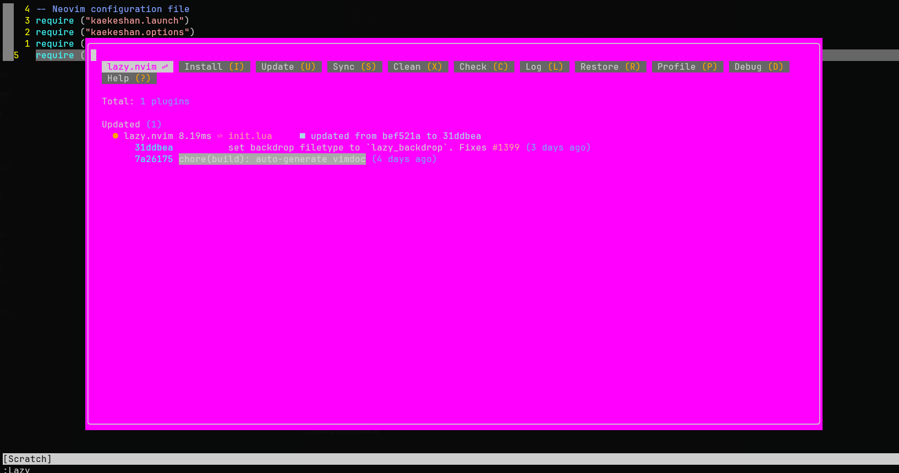

[Lazy.nvim](https://github.com/folke/lazy.nvim) is a package manager for Neovim that handles plugin installation, updates, lazy-loading, and configuration from a single Lua entry point.

## Bootstrap

Create a `lazy.lua` file under your namespace directory, then `require` it from `init.lua`:

```lua
require("<namespace>.lazy")
```

The bootstrap snippet clones lazy.nvim into the standard data path on first run if it isn't there yet:

```lua
local lazypath = vim.fn.stdpath "data" .. "/lazy/lazy.nvim"
if not vim.loop.fs_stat(lazypath) then
    vim.fn.system {
        "git",
        "clone",
        "--filter=blob:none",
        "https://github.com/folke/lazy.nvim.git",
        "--branch=stable",
        lazypath
    }
end
vim.opt.rtp:prepend(lazypath) -- rtp = runtime path

require("lazy").setup {
    spec = LAZY_PLUGIN_SPEC, -- global spec table
    install = {
        colorscheme = {"darkplus", "default"}
    },
    ui = {
        border = "rounded"
    },
    change_detection = {
        enabled = true,
        notify = false
    }
}
```

>[!info] Where `lazypath` points on Windows
>
> `vim.fn.stdpath("data")` resolves to something like `C:\Users\<user>\AppData\Local\nvim-data`. Run `lua print(vim.fn.stdpath("data"))` in Neovim to see the exact value on your machine.
>
> 

To open the Lazy UI, run the `:Lazy` command. The window lists installed plugins, pending updates, and lets you sync or clean up:



## Plugins

Each plugin gets its own `<plugin>.lua` file under your namespace directory. The `spec` table is the lazy.nvim convention: it lists the source, loading trigger, dependencies, and a `config()` function that runs when the plugin loads.

>[!tip] Keep `lazy = false` for your colorscheme
>
> If `darkplus` (or whatever you use) is your main colorscheme, set `lazy = false` and `priority = 1000` so it loads before any plugin tries to apply its own colors.

Example colorscheme spec:

```lua
local SPEC = {
    "LunarVim/darkplus.nvim",
    lazy = false,        -- load at startup if this is your main colorscheme
    priority = 1000      -- load before all other start plugins
}

function SPEC.config()
    vim.cmd.colorscheme "darkplus"
end

return SPEC
```